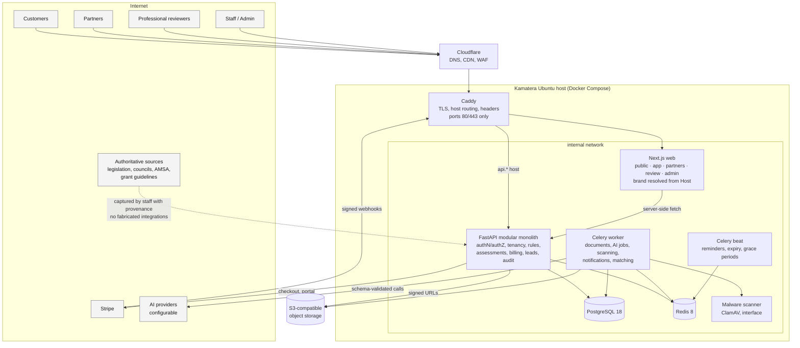
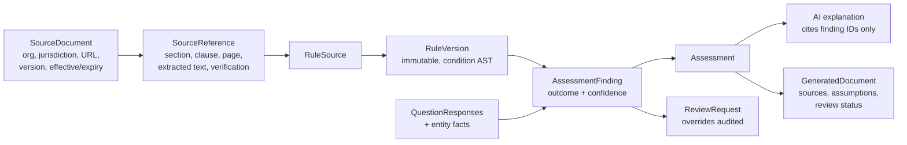
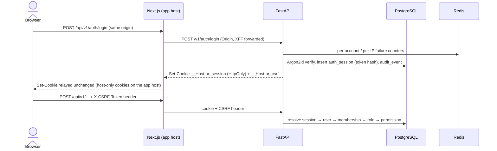
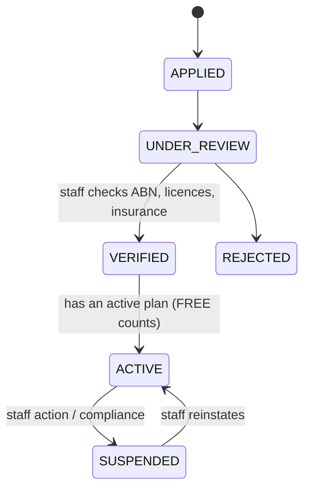
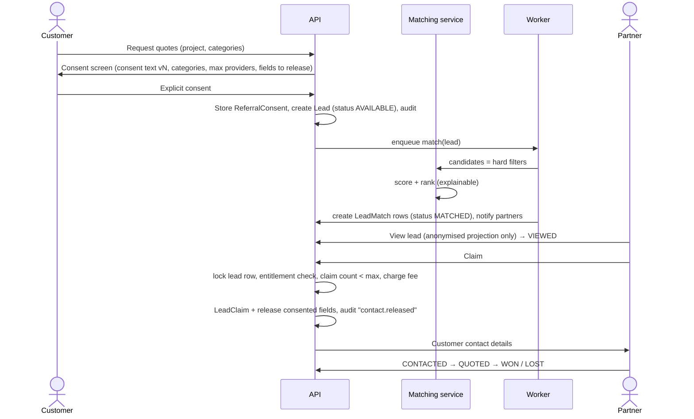

# ApprovalReady Architecture

ApprovalReady is one modular SaaS platform for Australian approvals, compliance,
property and funding. Six customer products (PlanningReady, VesselReady,
BusinessReady, GrantReady, SellReady, RentReady; the last two marketed as
PropertyReady) share one backend, one database, one frontend application and one
deployment.

Companion documents:

| Document | Contents |
|---|---|
| [`docs/ASSESSMENT.md`](docs/ASSESSMENT.md) | Current-state repository assessment |
| [`docs/DOMAIN_MODEL.md`](docs/DOMAIN_MODEL.md) | PostgreSQL domain model (all entities, keys, constraints) |
| [`docs/RISKS.md`](docs/RISKS.md) | Security and regulatory-data risks with mitigations |
| [`docs/DEPLOY_KAMATERA.md`](docs/DEPLOY_KAMATERA.md) | Production deployment runbook |
| [`TODO.md`](TODO.md) | Milestones and status |

---

## 1. Core principle: the LLM is never the authority

```
AUTHORITATIVE SOURCE  (legislation, planning scheme, AMSA, council, grant guidelines)
        ↓  captured by staff with provenance (URL, version, clause, page, retrieved/effective dates)
STRUCTURED REGULATORY DATA  (SourceDocument → SourceReference)
        ↓  encoded and reviewed by humans
VERSIONED RULES ENGINE  (RuleSet → Rule → RuleVersion, immutable once published)
        ↓  pure, deterministic evaluation over questionnaire answers + entity facts
DETERMINISTIC RESULT  (Assessment → AssessmentFinding with confidence)
        ↓  read-only input
AI EXPLANATION / DOCUMENT GENERATION  (schema-validated, cites finding IDs only)
```

Rules:

* A finding can only be `VERIFIED` when every contributing rule version links to a
  source reference whose verification status is `VERIFIED` and is in force on the
  assessment date. Otherwise it degrades to `LIKELY`, `REVIEW_REQUIRED` or `UNKNOWN`.
* The AI layer receives findings + sources as data and may only reference findings
  by ID. Post-generation validation rejects output that introduces fees, dates,
  clause numbers or requirements not present in the input findings.
* Trace chain stored for every result:
  `Customer result → AssessmentFinding → RuleVersion → RuleSource → SourceReference → SourceDocument`.

## 2. System architecture

### 2.1 Runtime components

| Component | Tech | Responsibility |
|---|---|---|
| `proxy` | Caddy 2 | TLS termination (or Cloudflare origin cert), host routing, security headers, request size limits. The only container with published ports (80/443). |
| `web` | Next.js 16 (App Router, TypeScript, React 19) | Public marketing/SEO pages (SSG/ISR), customer app, partner portal, review portal, admin. Resolves hostname → surface + brand. Server components call the API over the internal network. |
| `api` | FastAPI on Uvicorn, Python 3.14 | All business logic and authorisation. Modular monolith. |
| `worker` | Celery | Document generation, AI jobs, malware scanning, notifications, lead matching fan-out, Stripe webhook post-processing. |
| `scheduler` | Celery beat | Reminders (rent review, lease renewal, bond), subscription grace-period expiry, lead expiry, source re-verification reminders. Exactly one instance. |
| `db` | PostgreSQL 18 | System of record. Internal network only. |
| `redis` | Redis 8 | Celery broker/results, rate limiting, short-lived cache. Internal network only, password protected. |
| Object storage | Local volume in dev; S3-compatible in prod (MinIO/Wasabi/Backblaze/AWS) | Uploaded and generated documents. Private by default, signed URLs. |

### 2.2 Backend module layout (modular monolith)

```
apps/api/app/
  core/            config, logging, db, redis, security headers, request context
  api/             HTTP routers (health now; v1 routers per module later)
  modules/
    identity/      users, credentials, sessions, email verification, password reset
    tenancy/       organisations, members, roles, permissions, policy checks
    audit/         append-only audit events
    projects/      projects, verticals, statuses, tasks, reminders
    entities/      properties, ownership, vessels, business profiles, customer profiles
    questionnaires/
    regulatory/    source documents, references, verification workflow
    rules/         rule sets, versions, condition AST, evaluator (no eval)
    assessments/   assessment runs, findings, requirements
    documents/     uploads, scanning, storage, generated documents, templates
    ai/            provider abstraction, prompt registry, job log, output validation
    review/        professionals, credentials, review workflow
    billing/       products, prices, Stripe, subscriptions, entitlements, credits
    partners/      partner orgs, plans, applications, service areas, preferences
    leads/         lead creation, matching, release, claiming, outcomes
    consent/       consent text versions, referral consents
    notifications/
    branding/      domain → brand → surface configuration
    verticals/     planning, vessel, business, grants, sell, rent (thin: workflow + rule-pack wiring)
  worker/          Celery app and task registration
```

Module rules: modules talk through service functions, not each other's tables.
Each module owns its tables and Alembic migrations live in one linear history.

### 2.3 Mermaid architecture diagram



Regulatory data flow:



## 3. Database / domain architecture (summary)

Full model: [`docs/DOMAIN_MODEL.md`](docs/DOMAIN_MODEL.md). Conventions:

* UUID primary keys (`uuid` type; v7 generated application-side for index locality).
* Every table: `created_at`, `updated_at` (timestamptz, UTC), `created_by` (nullable FK to user).
  Soft-deletable tables add `deleted_at`. Audit and finding tables are append-only (no update/delete grants for the app role on `audit_event`).
* Tenancy: every tenant-owned row carries `organisation_id`. Every user gets a personal organisation on registration, so "personal account" is just an organisation of kind `PERSONAL`. This removes the user-or-org polymorphism everywhere else.
* Enumerations stored as `text` with `CHECK` constraints (cheaper to evolve than PG enums) and mirrored as Python `StrEnum`.
* Money as `bigint` cents + `currency char(3)` (default `AUD`). Prices never hard-coded.
* JSONB only for genuinely schemaless payloads (rule condition AST, answer values, AI output); everything queried or joined is a column.

Bounded contexts and their main aggregates:

| Context | Aggregates |
|---|---|
| Identity & tenancy | User, Credential, Session, Organisation, OrganisationMember, Role, Permission |
| Customer entities | CustomerProfile, BusinessProfile, Property, PropertyOwnership, Vessel |
| Projects | Project (vertical, status), Task, Reminder |
| Questionnaires | Questionnaire → QuestionnaireVersion → QuestionVersion → QuestionOption; QuestionnaireSubmission → QuestionResponse |
| Regulatory | SourceDocument → SourceReference |
| Rules | RuleSet → Rule → RuleVersion (+ RuleCondition AST, RuleOutcome, RuleSource) |
| Assessments | Assessment → AssessmentFinding → ApprovalRequirement / EvidenceRequirement |
| Documents | UploadedDocument, Evidence, DocumentTemplate(+Version), GeneratedDocument |
| AI | AIJob, AIProviderLog, PromptVersion |
| Review | Professional, ProfessionalCredential, ProfessionalService, ReviewRequest, ReviewDecision, FindingOverride |
| Billing | Product, Price, Payment, Subscription, Entitlement, CreditLedgerEntry, InvoiceReference, StripeEvent |
| Partners | PartnerOrganisation (extends Organisation), PartnerApplication, PartnerPlan, PlanFeature, PartnerSubscription, PartnerCategory, PartnerServiceArea, PartnerLeadPreference, ProviderProfile |
| Leads | Lead, LeadMatch, LeadClaim, LeadStatusEvent, LeadReleasePolicy, QuoteRequest, Quote |
| Consent | ConsentTextVersion, Consent (service/marketing), ReferralConsent |
| Grants | GrantProfile, GrantProgram, GrantRound, GrantEligibilityRule (→ RuleVersion), GrantMatch |
| Property | SaleProject, SaleOffer, RentalPropertyProfile, Tenancy, TenantApplication, Inspection, InspectionItem, PropertyMaintenanceItem |
| Platform | AuditEvent, Notification, Brand, BrandDomain, FeatureFlag |

## 4. Domain-routing architecture

One Next.js deployment and one API serve every hostname. Routing is **data**, not code.

```
Request Host ─▶ Caddy (TLS; all brand hosts → web, api.* → api)
            ─▶ Next.js middleware: resolve Host → { brand, surface }
            ─▶ rewrite to /(surface)/... route group, inject brand into request headers
            ─▶ server components read brand (logo, name, theme accent, metadata, SEO, canonical host)
```

**Surfaces** (each a Next.js route group with its own layout/shell/login):

| Surface | Default host | Notes |
|---|---|---|
| `public` | `approvalready.com.au` | Marketing, vertical landing pages, SEO guides, `/partners` explainer. SSG/ISR. |
| `app` | `app.approvalready.com.au` | Customer dashboard (projects, questionnaires, documents, quotes). |
| `partners` | `partners.approvalready.com.au` | Partner login, dashboard, lead inbox, billing. |
| `review` | `review.approvalready.com.au` | Professional review queue. |
| `admin` | `app.approvalready.com.au/admin` | Staff tools; additionally IP-allowlist capable at Caddy. |
| `api` | `api.approvalready.com.au` | FastAPI; never served by Next.js. |

**Brand configuration** (`brand`, `brand_domain` tables; cached in Redis and in the web
process, with a static fallback file for build-time SSG):

| Field | Example |
|---|---|
| `brand.key` | `approvalready`, `planningready` |
| `brand.product_name`, `logo_asset`, `theme_accent`, `default_vertical` | |
| `brand.seo` (title template, description, OG image) | |
| `brand_domain.hostname` | `planningready.com.au` |
| `brand_domain.mode` | `PRIMARY` (serve), `REDIRECT` (301 to `redirect_target`), `ALIAS` (serve but canonical points elsewhere) |
| `brand_domain.surface` | `public`, `app`, `partners`, `review` |
| `brand_domain.redirect_target` | `https://approvalready.com.au/planning` |

Recommended default (concentrates SEO authority): the parent domain serves everything;
vertical domains (`planningready.com.au`, `vesselready.com.au`, `grantready.com.au`,
`rentready.com.au`, …) are `REDIRECT` rows → `approvalready.com.au/<vertical>`.
Domain availability is not assumed; adding a domain is an admin data change plus a DNS
record and a Caddy on-demand-TLS allowlist entry (Caddy asks the API
`/internal/tls/allowed?domain=` before issuing a certificate).

Cookies: session cookies are host-only per surface (`__Host-` prefix), so a partner
session on `partners.` is not sent to `app.`. The API is called server-side from Next.js
(BFF pattern) for authenticated pages, so the browser never holds a bearer token.

## 5. Authentication and authorisation (built in Milestone 2)



* **Passwords:** Argon2id (`argon2-cffi` defaults, RFC 9106 profile), rehash on login when
  parameters change. Minimum 12 characters, maximum 256, not equal to the email. Unknown
  emails still run an Argon2 verification against a dummy hash (timing).
* **Sessions:** opaque 256-bit tokens; only SHA-256 hashes are stored (`auth_session`).
  Idle timeout 30 min (sliding, written at most once a minute), absolute lifetime 14 days,
  periodic rotation every 60 min with a 60 s grace period for in-flight requests, strict
  rotation (no grace) on privilege changes (organisation switch, password change).
  Server-side revocation: logout, logout everywhere, password change (other sessions),
  password reset (all sessions). No JWTs anywhere, nothing in browser storage.
* **Cookies:** `__Host-ar_session` (HttpOnly, Secure, SameSite=Lax, Path=/, no Domain) and
  `__Host-ar_csrf` (readable by script). `COOKIE_SECURE=false` (dev/test only, refused in
  production) drops the prefix so plain-HTTP localhost works.
* **BFF:** the browser only calls the web origin. `/api/v1/*` in Next.js proxies an
  allowlist of API areas (`auth`, `organisations`, `invitations`, `admin`), forwarding only
  allowlisted headers and relaying `Set-Cookie`. Server components fetch the session with
  the user's cookies (`src/lib/session.ts`).
* **CSRF:** SameSite=Lax, plus a double-submit token for every cookie-authenticated
  state change. The token is `HMAC(SECRET_KEY, session_id)`, so it survives token rotation
  and cannot be forged by planting a cookie. An Origin check rejects state-changing requests
  from origins outside `CORS_ORIGINS` (covers login CSRF, before a session exists).
* **Enumeration resistance:** register, resend-verification and password-reset requests
  always return `202 {"status":"accepted"}`. Registering an existing address emails that
  address instead of returning an error. Login says "email not verified" only after a
  correct password.
* **Throttling (Redis, fixed windows):** 5 failed logins per account and 30 per IP per
  15 min, then 429 with `Retry-After`; 30 unauthenticated auth requests per IP per minute;
  3 emails of one kind per address per hour (no mail bombing). Email addresses are hashed
  in Redis keys.
* **Email verification and reset:** single-use hashed tokens in `one_time_token`; issuing
  a new link invalidates older ones. Login requires a verified email. Reset links expire
  after 60 min and sign the user out everywhere.
* **Email delivery:** `EmailProvider` protocol with SMTP (Mailpit in dev, any relay in
  production, verified STARTTLS), console and in-memory implementations.
* **Future SSO/passkeys:** `auth_identity (provider, subject)` exists; Google/Microsoft
  OIDC and WebAuthn plug in by creating sessions through the same `create_session`.

**Organisations and RBAC.** Every user gets a `PERSONAL` organisation at registration with
`CUSTOMER` + `ORG_ADMIN`. Users can create `BUSINESS` and `PROFESSIONAL_PRACTICE`
organisations; `PARTNER` organisations arrive through the partner application flow
(Milestone 14) and the `PLATFORM_ADMIN` organisation is bootstrapped by CLI only
(`python -m app.cli grant-platform-role`). Members join by emailed, single-use invitation
bound to the invited address.

| Role | Granted in | Permissions (summary) |
|---|---|---|
| `CUSTOMER` | PERSONAL, BUSINESS | org read, members read, project read/write |
| `ORG_ADMIN` | PERSONAL, BUSINESS, PROFESSIONAL_PRACTICE | org update, members manage, invitations, org audit |
| `PROFESSIONAL` | PROFESSIONAL_PRACTICE | review.perform, project read |
| `PARTNER_USER` | PARTNER | lead read/claim |
| `PARTNER_ADMIN` | PARTNER | partner user + org admin |
| `STAFF` | PLATFORM_ADMIN | platform users/organisations read, source.verify |
| `ADMIN` | PLATFORM_ADMIN | staff + platform audit, rule.publish, org admin |
| `SUPERADMIN` | PLATFORM_ADMIN | admin + platform.roles.manage |

`ORG_ADMIN` is an addition to the brief's role list: business and practice owners need to
manage their members without being given partner or platform roles. Rules enforced in the
service layer (and the first one again by a database trigger):

1. A role can only be granted in the organisation kinds it lists.
2. No escalation: an actor can only grant roles whose permissions are a subset of their
   own, and can only change or remove members whose permissions are a subset of theirs.
3. Every organisation keeps at least one active member with `org.members.manage`.

Authorisation lives in `app/api/deps.py`. Routes under `/v1/organisations/{id}` resolve the
caller's *current* membership of that organisation on every request (so removal or demotion
takes effect immediately) and answer **404** when there is none, so other tenants'
organisations are indistinguishable from non-existent ones. Platform permissions apply only
while the session's active organisation is the `PLATFORM_ADMIN` organisation (explicit
context switch, audited). Postgres Row-Level Security is the planned second layer once the
first tenant-owned business tables land (Milestone 3; see `docs/RISKS.md` S1).

**Audit.** `audit_event` is append-only: `BEFORE UPDATE/DELETE/TRUNCATE` triggers reject
changes for every role, including the owner. Each row stores `hash = SHA-256(canonical JSON
of the row + prev_hash)`; writers serialise on a transaction-scoped advisory lock so `seq`
order equals chain order, and the event commits in the same transaction as the change it
records. `python -m app.cli verify-audit` and `GET /v1/admin/audit/verify` (platform
`platform.audit.read`) recompute the chain and report the first broken row. Audited actions
include registration, verification, login success/failure (email hashed, never stored in
clear), logout, password reset/change, organisation switch, organisation create/update,
member role changes and removals, invitations created/revoked/accepted, and platform role
grants.

## 6. Partner-subscription architecture



Two independent state machines, deliberately separate (paying ≠ verified):

1. **Partner verification status** (`partner_organisation.verification_status`):
   `APPLIED → UNDER_REVIEW → VERIFIED → ACTIVE`, or `SUSPENDED` / `REJECTED`. Changed only by staff, audited.
   Credentials (licence numbers, PI/PL insurance with expiry) are per-category; an expired
   credential removes eligibility for categories that require it.
2. **Partner subscription status** (`partner_subscription.status`), driven **only** by
   verified Stripe webhooks: `TRIALING`, `ACTIVE`, `PAST_DUE`, `CANCELED`, `UNPAID`, `INCOMPLETE`.

**Plans and features are data**: `partner_plan` (`FREE`, `STANDARD`, `PRO`, `ENTERPRISE`
as seed rows, not code), `plan_feature` (feature key + limit, e.g. `lead.monthly_allowance=20`,
`lead.price_discount_bps=2500`, `lead.premium_access=true`, `notifications.priority=true`,
`seats.max=10`), and `price` rows linked to Stripe price IDs. Lead prices live on
`lead_price` (category × value band × plan), editable by admins.

**Entitlement check** (single function, `partners.entitlements.can(partner, action, lead)`),
used by every guarded endpoint and by the matching engine:

```
can_claim(partner, lead):
  partner.verification_status == ACTIVE
  and subscription.status in {ACTIVE, TRIALING}
      or (status == PAST_DUE and now < past_due_since + plan.grace_period)  # if configured
  and plan has feature for lead.tier (premium leads need lead.premium_access)
  and partner holds a current credential for lead.category if category.requires_credential
  and partner has allowance remaining OR credit balance >= lead price
  and lead.release_policy allows another claim (e.g. max 3)
```

On `invoice.payment_failed` → `PAST_DUE`: new premium access stops after the grace
period, history is preserved, billing portal remains reachable. Webhooks are verified
(signature + timestamp), stored idempotently in `stripe_event` (unique event ID), and
processed by the worker. The frontend never decides payment state.

Billing ledger: `credit_ledger_entry` (append-only; purchases, promotional credits, lead
charges, refunds) with a materialised balance; lead fees are recorded at claim time in
the same DB transaction as the claim.

## 7. Lead-matching architecture



**Stage 1 — hard filters (eligibility, never bought):** category served; service area
contains the project location (postcode list, LGA, or radius from office point, stored
as `partner_service_area`); verification ACTIVE; required credentials current; entitlement
allows this lead tier; capacity (`max_open_leads`, paused flag); lead preferences
(project types, min/max value band, timing); not previously declined/excluded by the customer.

**Stage 2 — ranking (explainable, recorded on `lead_match.score_breakdown` JSONB):**
geographic fit, category specificity, credentials, availability, response rate and median
response time, historic customer outcomes (ratings, win rate where customer confirmed),
and plan-feature eligibility (e.g. PRO gets earlier notification window). Payment is a
bounded signal, never the sole or dominant one; any paid placement is flagged
`is_promoted=true` and shown to the customer as "Sponsored".

**Release rules** (`lead_release_policy`, per category/vertical): max providers (default 3),
exclusivity window, claim expiry, auto-expire after N days, fields releasable. The
anonymised projection (`LeadPublicView`) is a separate Pydantic schema built from
whitelisted fields, so PII cannot leak via a forgotten column. Contact details are only
returned from the claim endpoint and only for fields listed in the consent.

**Concurrency:** claim uses `SELECT … FOR UPDATE` on the lead row; claim count, fee charge,
status change and audit event commit in one transaction. Unique constraint
`(lead_id, partner_organisation_id)` on `lead_claim`.

Lead statuses (per match, since one lead goes to several partners): `AVAILABLE` (lead
only), `MATCHED`, `VIEWED`, `CLAIMED`, `CONTACTED`, `QUOTED`, `WON`, `LOST`, `EXPIRED`,
`DECLINED`. Every transition is a `lead_status_event` row and an audit event.

Partner analytics are computed per partner only (own leads, spend, conversion, response
time, category and geography performance). No competitor data, no market-wide figures
unless aggregated across ≥ k partners (k-anonymity threshold, default 5).

## 8. Rules engine (design; built in Milestone 4)

* Condition AST in JSONB, validated by a Pydantic discriminated union:
  `{"all": [...]}`, `{"any": [...]}`, `{"not": {...}}`, and leaf
  `{"fact": "property.lot_size_m2", "op": "greater_equal", "value": 600}`.
* Operators: `equals, not_equals, greater_than, less_than, greater_equal, less_equal,
  contains, not_contains, in, not_in, exists, missing, all, any`. Implemented as a
  dispatch table of pure functions. No `eval`, no expression strings.
* Three-valued logic: a leaf on a missing fact yields `UNKNOWN`, which propagates
  (`all` with an unknown and no false → unknown). This is what turns missing
  information into `UNKNOWN` / `NEEDS_INFORMATION` instead of a false negative.
* `RuleVersion` is immutable once `PUBLISHED`; edits create a new version. An assessment
  stores `rule_version_id` for every finding plus a hash of the input facts, making
  results reproducible.

## 9. AI layer (design; built in Milestone 12)

`AIProvider` protocol: `generate_structured(schema, prompt)`, `generate_text`,
`extract_document`, `summarise`, `classify`. Providers selected per task from
configuration (env + admin settings). Every call logged to `ai_provider_log`
(provider, model, task, project, prompt version, schema version, tokens, cost, status,
error). Uploaded content is passed inside delimited, labelled data blocks; the model has
no tools that change permissions, rules or settings; outputs are Pydantic-validated and
post-checked against the findings they are meant to explain.

## 10. Deployment topology

Single Kamatera Ubuntu LTS host running `docker-compose.prod.yml`. Only Caddy publishes
ports 80/443; `db` and `redis` sit on an internal Docker network with no published ports
and the host firewall (UFW + Kamatera firewall) allows only 22 (restricted), 80, 443.
Migration path: point `DATABASE_URL` at a managed/separate Postgres, run `worker` on a
second host against the same Redis, switch `STORAGE_BACKEND=s3`, put Cloudflare CDN in
front of static assets, and run multiple `web`/`api` replicas behind Caddy — all
configuration changes, no code changes. See `docs/DEPLOY_KAMATERA.md`.

## 11. Milestone 1 as built

| Concern | Implementation |
|---|---|
| API | `apps/api`: FastAPI app factory, pydantic-settings config, structured JSON logging, request-ID middleware, security headers, strict CORS, trusted hosts, async SQLAlchemy engine, Redis client. |
| Health | `GET /health/live` (process up), `GET /health/ready` (DB + Redis, 503 if any fails), `GET /version`. |
| Migrations | Alembic configured; baseline migration enables `pgcrypto` and `citext` and creates nothing else. |
| Worker | Celery app (`app.worker`) with `system.ping` task; beat schedule placeholder. |
| Web | `apps/web`: Next.js 16 App Router, TypeScript strict, brand-neutral restrained landing page, `/api/health` route that also probes the API. |
| Packages | `packages/shared-types` (health/version contracts), `packages/ui` (design tokens). |
| Docker | Multi-stage Dockerfiles (non-root users). `docker-compose.yml` (dev), `docker-compose.prod.yml` (Caddy, internal-only DB/Redis, health checks, restart policies). |
| Host allowlist | `ALLOWED_HOSTS` plus always-trusted internal hosts (`127.0.0.1` for Docker health checks, `api` for web→API calls); neither is routable through Caddy. |
| CI | GitHub Actions: ruff, mypy, pytest against Postgres 18 + Redis services; web lint, typecheck, vitest, build; image builds; compose validation. |
| Verified | 42 API/infrastructure tests on Python 3.13 and 3.14, 9 web tests, prod stack smoke test through Caddy. |

## 12. Milestone 2 as built

| Concern | Implementation |
|---|---|
| Modules | `app/modules/identity` (users, credentials, sessions, tokens, emails), `app/modules/tenancy` (organisations, members, invitations, RBAC catalogue), `app/modules/audit` (hash-chained log). |
| Migration | `0002`: 11 tables, role/permission seed (frozen snapshot of `rbac.py`, checked by tests), audit immutability triggers, `member_role` organisation-kind trigger. |
| API | `/v1/auth/*` (register, verify-email, resend, login, logout, logout-all, session, switch organisation, password reset request/confirm, change password), `/v1/organisations/*` (create, read, update, members, roles, invitations, audit events), `/v1/invitations/accept`, `/v1/admin/audit/verify`. |
| Web | BFF proxy `/api/v1/*`, pages `/login`, `/register`, `/verify-email`, `/forgot-password`, `/reset-password`, `/invitations/accept`, `/account`. Per-request nonce CSP (`'strict-dynamic'`, no `'unsafe-inline'` scripts) on these pages via `src/proxy.ts`; statically generated public pages keep the baseline policy. |
| Types | `packages/shared-types/src/api.ts` generated from the API's OpenAPI schema (`npm run generate:types`); CI fails if the schema or types are stale. |
| Dev email | Mailpit in `docker-compose.yml` (UI `http://localhost:8025`). |
| Ops | `python -m app.cli grant-platform-role --email … --role SUPERADMIN`, `python -m app.cli verify-audit`. |
| Verified | 106 API/infrastructure tests (auth flows, throttling, rotation/expiry, CSRF/origin, tenant isolation as an outsider on every org route, privilege rules, append-only and tamper detection, RBAC seed), web unit tests, manual end-to-end run through the Next.js proxy. |
