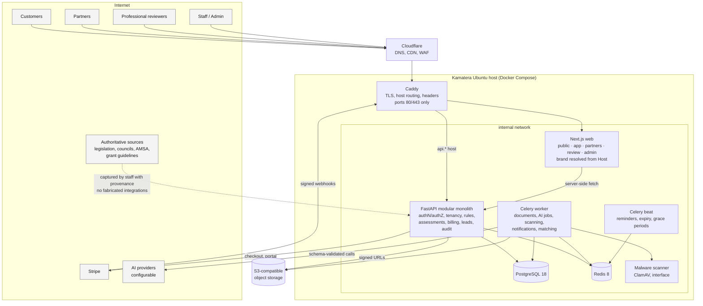
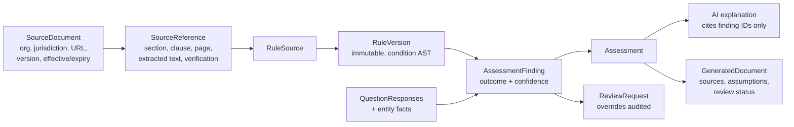
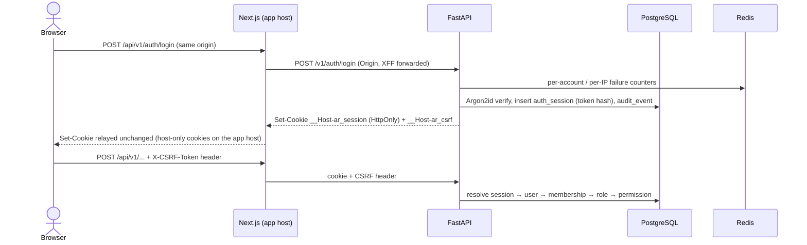
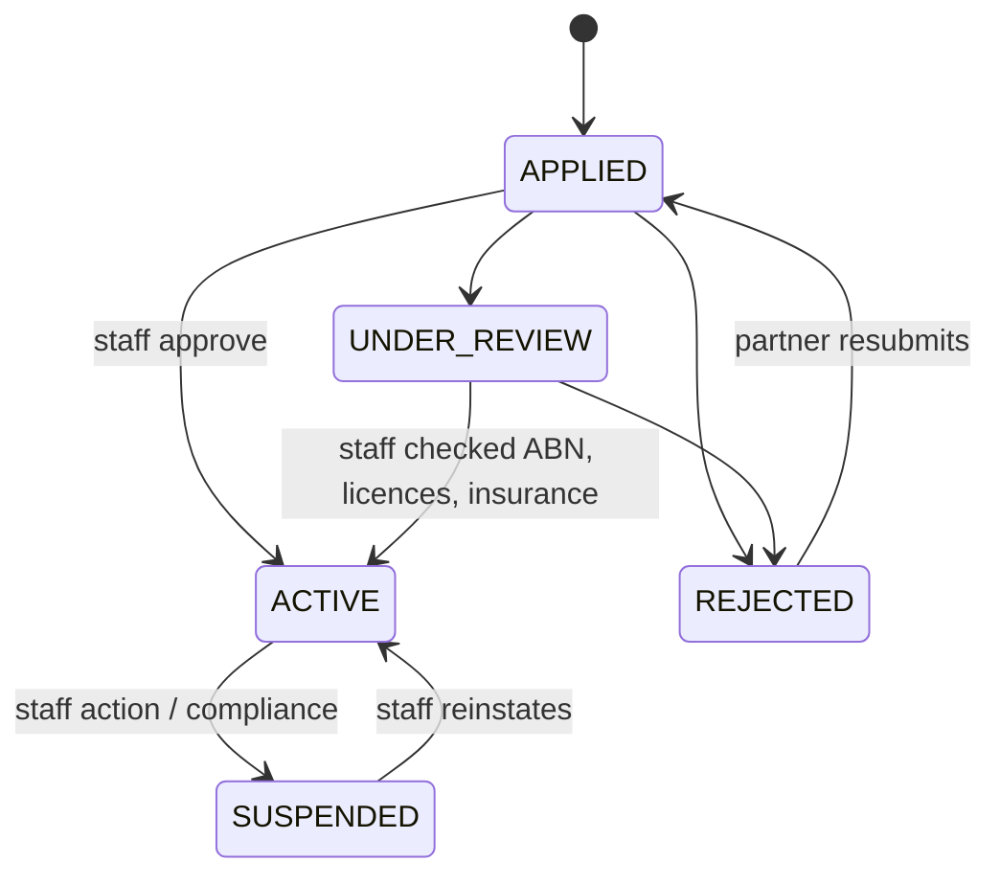
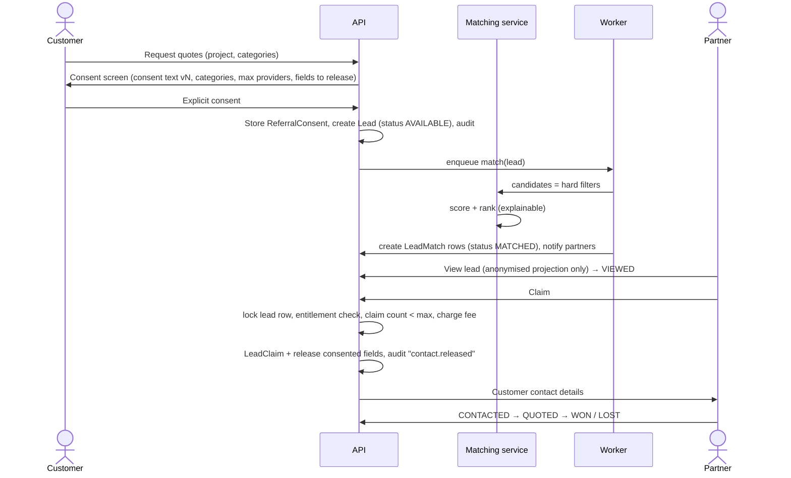

# ApprovalReady Architecture

ApprovalReady is one modular SaaS platform for Australian approvals, compliance,
property and funding. Six customer products (PlanningReady, VesselReady,
BusinessReady, GrantReady, SellReady, RentReady; the last two marketed as
PropertyReady) share one backend, one database, one frontend application and one
deployment.

Companion documents:

| Document | Contents |
|---|---|
| [`docs/ASSESSMENT.md`](docs/ASSESSMENT.md) | Current-state repository assessment |
| [`docs/DOMAIN_MODEL.md`](docs/DOMAIN_MODEL.md) | PostgreSQL domain model (all entities, keys, constraints) |
| [`docs/RISKS.md`](docs/RISKS.md) | Security and regulatory-data risks with mitigations |
| [`docs/DEPLOY_KAMATERA.md`](docs/DEPLOY_KAMATERA.md) | Production deployment runbook |
| [`TODO.md`](TODO.md) | Milestones and status |

---

## 1. Core principle: the LLM is never the authority

```
AUTHORITATIVE SOURCE  (legislation, planning scheme, AMSA, council, grant guidelines)
        ↓  captured by staff with provenance (URL, version, clause, page, retrieved/effective dates)
STRUCTURED REGULATORY DATA  (SourceDocument → SourceReference)
        ↓  encoded and reviewed by humans
VERSIONED RULES ENGINE  (RuleSet → Rule → RuleVersion, immutable once published)
        ↓  pure, deterministic evaluation over questionnaire answers + entity facts
DETERMINISTIC RESULT  (Assessment → AssessmentFinding with confidence)
        ↓  read-only input
AI EXPLANATION / DOCUMENT GENERATION  (schema-validated, cites finding IDs only)
```

Rules:

* A finding can only be `VERIFIED` when every contributing rule version links to a
  source reference whose verification status is `VERIFIED` and is in force on the
  assessment date. Otherwise it degrades to `LIKELY`, `REVIEW_REQUIRED` or `UNKNOWN`.
* The AI layer receives findings + sources as data and may only reference findings
  by ID. Post-generation validation rejects output that introduces fees, dates,
  clause numbers or requirements not present in the input findings.
* Trace chain stored for every result:
  `Customer result → AssessmentFinding → RuleVersion → RuleSource → SourceReference → SourceDocument`.

## 2. System architecture

### 2.1 Runtime components

| Component | Tech | Responsibility |
|---|---|---|
| `proxy` | Caddy 2 | TLS termination (or Cloudflare origin cert), host routing, security headers, request size limits. The only container with published ports (80/443). |
| `web` | Next.js 16 (App Router, TypeScript, React 19) | Public marketing/SEO pages (SSG/ISR), customer app, partner portal, review portal, admin. Resolves hostname → surface + brand. Server components call the API over the internal network. |
| `api` | FastAPI on Uvicorn, Python 3.14 | All business logic and authorisation. Modular monolith. |
| `worker` | Celery | Document generation, AI jobs, malware scanning, notifications, lead matching fan-out, Stripe webhook post-processing. |
| `scheduler` | Celery beat | Reminders (rent review, lease renewal, bond), subscription grace-period expiry, lead expiry, source re-verification reminders. Exactly one instance. |
| `db` | PostgreSQL 18 | System of record. Internal network only. |
| `redis` | Redis 8 | Celery broker/results, rate limiting, short-lived cache. Internal network only, password protected. |
| Object storage | Local volume in dev; S3-compatible in prod (MinIO/Wasabi/Backblaze/AWS) | Uploaded and generated documents. Private by default, signed URLs. |

### 2.2 Backend module layout (modular monolith)

```
apps/api/app/
  core/            config, logging, db, redis, security headers, request context
  api/             HTTP routers (health now; v1 routers per module later)
  modules/
    identity/      users, credentials, sessions, email verification, password reset
    tenancy/       organisations, members, roles, permissions, policy checks
    audit/         append-only audit events
    projects/      projects, verticals, statuses, tasks, reminders
    entities/      properties, ownership, vessels, business profiles, customer profiles
    questionnaires/
    regulatory/    source documents, references, verification workflow
    rules/         rule sets, versions, condition AST, evaluator (no eval)
    assessments/   assessment runs, findings, requirements
    documents/     uploads, scanning, storage, generated documents, templates
    ai/            provider abstraction, prompt registry, job log, output validation
    review/        professionals, credentials, review workflow
    billing/       products, prices, Stripe, subscriptions, entitlements, credits
    partners/      partner orgs, plans, applications, service areas, preferences
    leads/         lead creation, matching, release, claiming, outcomes
    analytics/     partner analytics, k-anonymous benchmarks, staff marketplace figures
    consent/       consent text versions, referral consents
    notifications/
    branding/      domain → brand → surface configuration
    verticals/     planning, vessel, business, grants, sell, rent (thin: workflow + rule-pack wiring)
  worker/          Celery app and task registration
```

Module rules: modules talk through service functions, not each other's tables.
Each module owns its tables and Alembic migrations live in one linear history.

### 2.3 Mermaid architecture diagram



Regulatory data flow:



## 3. Database / domain architecture (summary)

Full model: [`docs/DOMAIN_MODEL.md`](docs/DOMAIN_MODEL.md). Conventions:

* UUID primary keys (`uuid` type; v7 generated application-side for index locality).
* Every table: `created_at`, `updated_at` (timestamptz, UTC), `created_by` (nullable FK to user).
  Soft-deletable tables add `deleted_at`. Audit and finding tables are append-only (no update/delete grants for the app role on `audit_event`).
* Tenancy: every tenant-owned row carries `organisation_id`. Every user gets a personal organisation on registration, so "personal account" is just an organisation of kind `PERSONAL`. This removes the user-or-org polymorphism everywhere else. Tenant tables are also protected by Postgres row-level security (see §3.1).
* Enumerations stored as `text` with `CHECK` constraints (cheaper to evolve than PG enums) and mirrored as Python `StrEnum`.
* Money as `bigint` cents + `currency char(3)` (default `AUD`). Prices never hard-coded.
* JSONB only for genuinely schemaless payloads (rule condition AST, answer values, AI output); everything queried or joined is a column.

Bounded contexts and their main aggregates:

| Context | Aggregates |
|---|---|
| Identity & tenancy | User, Credential, Session, Organisation, OrganisationMember, Role, Permission |
| Customer entities | CustomerProfile, BusinessProfile, Property, PropertyOwnership, Vessel |
| Projects | Project (vertical, status), Task, Reminder |
| Questionnaires | Questionnaire → QuestionnaireVersion → QuestionVersion → QuestionOption; QuestionnaireSubmission → QuestionResponse |
| Regulatory | SourceDocument → SourceReference |
| Rules | RuleSet → Rule → RuleVersion (+ RuleCondition AST, RuleOutcome, RuleSource) |
| Assessments | Assessment → AssessmentFinding → ApprovalRequirement / EvidenceRequirement |
| Documents | UploadedDocument, Evidence, DocumentTemplate(+Version), GeneratedDocument |
| AI | AIJob, AIProviderLog, PromptVersion |
| Review | Professional, ProfessionalCredential, ProfessionalService, ReviewRequest, ReviewDecision, FindingOverride |
| Billing | Product, Price, Feature, Payment, Subscription, Entitlement (computed), CreditLedgerEntry (Milestone 15), InvoiceReference, StripeEvent |
| Partners | PartnerOrganisation (extends Organisation), PartnerApplication, PartnerPlan, PlanFeature, PartnerSubscription, PartnerCategory, PartnerServiceArea, PartnerLeadPreference, ProviderProfile |
| Leads | Lead, LeadMatch, LeadClaim, LeadStatusEvent, LeadReleasePolicy, QuoteRequest, Quote |
| Consent | ConsentTextVersion, Consent (service/marketing), ReferralConsent |
| Grants | GrantProfile, GrantProgram, GrantRound, GrantEligibilityRule (→ RuleVersion), GrantMatch |
| Property | SaleProject, SaleOffer, RentalPropertyProfile, Tenancy, TenantApplication, Inspection, InspectionItem, PropertyMaintenanceItem |
| Platform | AuditEvent, Notification, Brand, BrandDomain, FeatureFlag |

### 3.1 Database roles and row-level security (built in Milestone 3)

Application authorisation (membership and permission checks on every `/organisations/{id}`
route) is the first line. Row-level security is the second: if application code ever forgets a
tenant filter, the database still returns nothing from other organisations.

| Role | Used by | Can |
|---|---|---|
| Owner (`POSTGRES_USER`) | `migrate` only (`MIGRATION_DATABASE_URL`) | Owns every table; runs Alembic, `provision-db-role`, `questionnaires sync`. |
| `approvalready_rw` (NOLOGIN group) | — | Holds the application's grants, table by table (reviewed map in the `0003` migration, asserted by `tests/test_rls.py`). Reference and questionnaire-definition tables are read-only; `audit_event` and `project_status_event` are insert/select only. |
| `approvalready_app` (LOGIN, `APP_DB_USER`) | `api`, `worker` (`DATABASE_URL`) | Member of `approvalready_rw`; `NOSUPERUSER NOBYPASSRLS`, owns nothing. `/health/ready` fails in production if this ever stops being true. |

* Every table with `organisation_id` (the `TenantMixin` tables) has `ENABLE` and `FORCE ROW
  LEVEL SECURITY` and one policy, `tenant_isolation`:
  `organisation_id = nullif(current_setting('app.current_org', true), '')::uuid` for both
  `USING` and `WITH CHECK`. With no tenant bound, nothing is visible and nothing can be written.
* The tenant is bound per transaction (`set_config('app.current_org', …, true)`), only after the
  membership check in `require_org_permission`. A SQLAlchemy `after_begin` listener re-applies it
  at the start of every transaction in the same request, and the transaction-local setting
  cannot leak to the next user of a pooled connection.
* Foreign-key checks bypass RLS, so tenant-to-tenant references are composite:
  `(organisation_id, project_id) → project(organisation_id, id)`. A row can never point at
  another organisation's row, even when written by the owner.
* Identity and tenancy tables (users, sessions, memberships) are not tenant-scoped: they are read
  before a tenant is known, and stay protected by application authorisation.

## 4. Domain-routing architecture

One Next.js deployment and one API serve every hostname. Routing is **data**, not code.

```
Request Host ─▶ Caddy (TLS; all brand hosts → web, api.* → api)
            ─▶ Next.js middleware: resolve Host → { brand, surface }
            ─▶ rewrite to /(surface)/... route group, inject brand into request headers
            ─▶ server components read brand (logo, name, theme accent, metadata, SEO, canonical host)
```

**Surfaces** (each a Next.js route group with its own layout/shell/login):

| Surface | Default host | Notes |
|---|---|---|
| `public` | `approvalready.com.au` | Marketing, vertical landing pages, SEO guides, `/partners` explainer. SSG/ISR. |
| `app` | `app.approvalready.com.au` | Customer dashboard (projects, questionnaires, documents, quotes). |
| `partners` | `partners.approvalready.com.au` | Partner login, dashboard, lead inbox, billing. |
| `review` | `review.approvalready.com.au` | Professional review queue. |
| `admin` | `app.approvalready.com.au/admin` | Staff tools; additionally IP-allowlist capable at Caddy. |
| `api` | `api.approvalready.com.au` | FastAPI; never served by Next.js. |

**Brand configuration** (`brand`, `brand_domain` tables; cached in Redis and in the web
process, with a static fallback file for build-time SSG):

| Field | Example |
|---|---|
| `brand.key` | `approvalready`, `planningready` |
| `brand.product_name`, `logo_asset`, `theme_accent`, `default_vertical` | |
| `brand.seo` (title template, description, OG image) | |
| `brand_domain.hostname` | `planningready.com.au` |
| `brand_domain.mode` | `PRIMARY` (serve), `REDIRECT` (301 to `redirect_target`), `ALIAS` (serve but canonical points elsewhere) |
| `brand_domain.surface` | `public`, `app`, `partners`, `review` |
| `brand_domain.redirect_target` | `https://approvalready.com.au/planning` |

Recommended default (concentrates SEO authority): the parent domain serves everything;
vertical domains (`planningready.com.au`, `vesselready.com.au`, `grantready.com.au`,
`rentready.com.au`, …) are `REDIRECT` rows → `approvalready.com.au/<vertical>`.
Domain availability is not assumed; adding a domain is an admin data change plus a DNS
record and a Caddy on-demand-TLS allowlist entry (Caddy asks the API
`/internal/tls/allowed?domain=` before issuing a certificate).

Cookies: session cookies are host-only per surface (`__Host-` prefix), so a partner
session on `partners.` is not sent to `app.`. The API is called server-side from Next.js
(BFF pattern) for authenticated pages, so the browser never holds a bearer token.

## 5. Authentication and authorisation (built in Milestone 2)



* **Passwords:** Argon2id (`argon2-cffi` defaults, RFC 9106 profile), rehash on login when
  parameters change. Minimum 12 characters, maximum 256, not equal to the email. Unknown
  emails still run an Argon2 verification against a dummy hash (timing).
* **Sessions:** opaque 256-bit tokens; only SHA-256 hashes are stored (`auth_session`).
  Idle timeout 30 min (sliding, written at most once a minute), absolute lifetime 14 days,
  periodic rotation every 60 min with a 60 s grace period for in-flight requests, strict
  rotation (no grace) on privilege changes (organisation switch, password change).
  Server-side revocation: logout, logout everywhere, password change (other sessions),
  password reset (all sessions). No JWTs anywhere, nothing in browser storage.
* **Cookies:** `__Host-ar_session` (HttpOnly, Secure, SameSite=Lax, Path=/, no Domain) and
  `__Host-ar_csrf` (readable by script). `COOKIE_SECURE=false` (dev/test only, refused in
  production) drops the prefix so plain-HTTP localhost works.
* **BFF:** the browser only calls the web origin. `/api/v1/*` in Next.js proxies an
  allowlist of API areas (`auth`, `organisations`, `invitations`, `admin`), forwarding only
  allowlisted headers and relaying `Set-Cookie`. Server components fetch the session with
  the user's cookies (`src/lib/session.ts`).
* **CSRF:** SameSite=Lax, plus a double-submit token for every cookie-authenticated
  state change. The token is `HMAC(SECRET_KEY, session_id)`, so it survives token rotation
  and cannot be forged by planting a cookie. An Origin check rejects state-changing requests
  from origins outside `CORS_ORIGINS` (covers login CSRF, before a session exists).
* **Enumeration resistance:** register, resend-verification and password-reset requests
  always return `202 {"status":"accepted"}`. Registering an existing address emails that
  address instead of returning an error. Login says "email not verified" only after a
  correct password.
* **Throttling (Redis, fixed windows):** 5 failed logins per account and 30 per IP per
  15 min, then 429 with `Retry-After`; 30 unauthenticated auth requests per IP per minute;
  3 emails of one kind per address per hour (no mail bombing). Email addresses are hashed
  in Redis keys.
* **Email verification and reset:** single-use hashed tokens in `one_time_token`; issuing
  a new link invalidates older ones. Login requires a verified email. Reset links expire
  after 60 min and sign the user out everywhere.
* **Email delivery:** `EmailProvider` protocol with SMTP (Mailpit in dev, any relay in
  production, verified STARTTLS), console and in-memory implementations.
* **Two-step sign-in (Milestone 18):** authenticator app codes (TOTP, RFC 6238) and ten
  single-use recovery codes. With it on, `POST /v1/auth/login` answers `{"mfa_required":
  true}` and a 5-minute HttpOnly challenge cookie instead of a session, and
  `POST /v1/auth/login/mfa` takes the code and creates the session (`mfa_verified_at`).
  Platform staff routes require such a session (`STAFF_MFA_REQUIRED`, default on). See §27.
* **Breached passwords and API limits (Milestone 18):** new passwords are refused when Have I
  Been Pwned's range API knows them (k-anonymity, fail open); every `/v1` route is limited
  per client IP (600 requests and 120 changes a minute by default). See §27.
* **Future SSO/passkeys:** `auth_identity (provider, subject)` exists; Google/Microsoft
  OIDC and WebAuthn plug in by creating sessions through the same `create_session`.

**Organisations and RBAC.** Every user gets a `PERSONAL` organisation at registration with
`CUSTOMER` + `ORG_ADMIN`. Users can create `BUSINESS` and `PROFESSIONAL_PRACTICE`
organisations; `PARTNER` organisations arrive through the partner application flow
(Milestone 14) and the `PLATFORM_ADMIN` organisation is bootstrapped by CLI only
(`python -m app.cli grant-platform-role`). Members join by emailed, single-use invitation
bound to the invited address.

| Role | Granted in | Permissions (summary) |
|---|---|---|
| `CUSTOMER` | PERSONAL, BUSINESS | org read, members read, project read/write |
| `ORG_ADMIN` | PERSONAL, BUSINESS, PROFESSIONAL_PRACTICE | org update, members manage, invitations, org audit |
| `PROFESSIONAL` | PROFESSIONAL_PRACTICE | review.perform, project read |
| `PARTNER_USER` | PARTNER | lead read/claim |
| `PARTNER_ADMIN` | PARTNER | partner user + org admin |
| `STAFF` | PLATFORM_ADMIN | platform users/organisations read, source.verify |
| `ADMIN` | PLATFORM_ADMIN | staff + platform audit, rule.publish, org admin |
| `SUPERADMIN` | PLATFORM_ADMIN | admin + platform.roles.manage |

`ORG_ADMIN` is an addition to the brief's role list: business and practice owners need to
manage their members without being given partner or platform roles. Rules enforced in the
service layer (and the first one again by a database trigger):

1. A role can only be granted in the organisation kinds it lists.
2. No escalation: an actor can only grant roles whose permissions are a subset of their
   own, and can only change or remove members whose permissions are a subset of theirs.
3. Every organisation keeps at least one active member with `org.members.manage`.

Authorisation lives in `app/api/deps.py`. Routes under `/v1/organisations/{id}` resolve the
caller's *current* membership of that organisation on every request (so removal or demotion
takes effect immediately) and answer **404** when there is none, so other tenants'
organisations are indistinguishable from non-existent ones. Platform permissions apply only
while the session's active organisation is the `PLATFORM_ADMIN` organisation (explicit
context switch, audited). Postgres Row-Level Security is the planned second layer once the
first tenant-owned business tables land (Milestone 3; see `docs/RISKS.md` S1).

**Audit.** `audit_event` is append-only: `BEFORE UPDATE/DELETE/TRUNCATE` triggers reject
changes for every role, including the owner. Each row stores `hash = SHA-256(canonical JSON
of the row + prev_hash)`; writers serialise on a transaction-scoped advisory lock so `seq`
order equals chain order, and the event commits in the same transaction as the change it
records. `python -m app.cli verify-audit` and `GET /v1/admin/audit/verify` (platform
`platform.audit.read`) recompute the chain and report the first broken row. Audited actions
include registration, verification, login success/failure (email hashed, never stored in
clear), logout, password reset/change, organisation switch, organisation create/update,
member role changes and removals, invitations created/revoked/accepted, and platform role
grants.

## 6. Partner-subscription architecture



As built in Milestone 14, `VERIFIED` is folded into `ACTIVE`: the free plan always counts, so a
verified partner always "has an active plan" and the extra state would never be observable.
Plans are products of kind `PARTNER_PLAN` in the Milestone 13 catalogue and a partner's plan is
an ordinary `subscription` of its organisation (no separate `partner_plan` or
`partner_subscription` tables). See §23.

Two independent state machines, deliberately separate (paying ≠ verified):

1. **Partner verification status** (`partner_organisation.verification_status`):
   `APPLIED → UNDER_REVIEW → VERIFIED → ACTIVE`, or `SUSPENDED` / `REJECTED`. Changed only by staff, audited.
   Credentials (licence numbers, PI/PL insurance with expiry) are per-category; an expired
   credential removes eligibility for categories that require it.
2. **Partner subscription status** (`partner_subscription.status`), driven **only** by
   verified Stripe webhooks: `TRIALING`, `ACTIVE`, `PAST_DUE`, `CANCELED`, `UNPAID`, `INCOMPLETE`.

**Plans and features are data**: `partner_plan` (`FREE`, `STANDARD`, `PRO`, `ENTERPRISE`
as seed rows, not code), `plan_feature` (feature key + limit, e.g. `lead.monthly_allowance=20`,
`lead.price_discount_bps=2500`, `lead.premium_access=true`, `notifications.priority=true`,
`seats.max=10`), and `price` rows linked to Stripe price IDs. Lead prices live on
`lead_price` (category × value band × plan), editable by admins.

**Entitlement check** (single function, `partners.entitlements.can(partner, action, lead)`),
used by every guarded endpoint and by the matching engine:

```
can_claim(partner, lead):
  partner.verification_status == ACTIVE
  and subscription.status in {ACTIVE, TRIALING}
      or (status == PAST_DUE and now < past_due_since + plan.grace_period)  # if configured
  and plan has feature for lead.tier (premium leads need lead.premium_access)
  and partner holds a current credential for lead.category if category.requires_credential
  and partner has allowance remaining OR credit balance >= lead price
  and lead.release_policy allows another claim (e.g. max 3)
```

On `invoice.payment_failed` → `PAST_DUE`: new premium access stops after the grace
period, history is preserved, billing portal remains reachable. Webhooks are verified
(signature + timestamp), stored idempotently in `stripe_event` (unique event ID), and
processed by the worker. The frontend never decides payment state.

Billing ledger: `credit_ledger_entry` (append-only; purchases, promotional credits, lead
charges, refunds) with a materialised balance; lead fees are recorded at claim time in
the same DB transaction as the claim.

## 7. Lead-matching architecture



**Stage 1 — hard filters (eligibility, never bought):** category served; service area
contains the project location (postcode list, LGA, or radius from office point, stored
as `partner_service_area`); verification ACTIVE; required credentials current; entitlement
allows this lead tier; capacity (`max_open_leads`, paused flag); lead preferences
(project types, min/max value band, timing); not previously declined/excluded by the customer.

**Stage 2 — ranking (explainable, recorded on `lead_match.score_breakdown` JSONB):**
geographic fit, category specificity, credentials, availability, response rate and median
response time, historic customer outcomes (ratings, win rate where customer confirmed),
and plan-feature eligibility (e.g. PRO gets earlier notification window). Payment is a
bounded signal, never the sole or dominant one; any paid placement is flagged
`is_promoted=true` and shown to the customer as "Sponsored".

**Release rules** (`lead_release_policy`, per category/vertical): max providers (default 3),
exclusivity window, claim expiry, auto-expire after N days, fields releasable. The
anonymised projection (`LeadPublicView`) is a separate Pydantic schema built from
whitelisted fields, so PII cannot leak via a forgotten column. Contact details are only
returned from the claim endpoint and only for fields listed in the consent.

**Concurrency:** claim uses `SELECT … FOR UPDATE` on the lead row; claim count, fee charge,
status change and audit event commit in one transaction. Unique constraint
`(lead_id, partner_organisation_id)` on `lead_claim`.

Lead statuses (per match, since one lead goes to several partners): `AVAILABLE` (lead
only), `MATCHED`, `VIEWED`, `CLAIMED`, `CONTACTED`, `QUOTED`, `WON`, `LOST`, `EXPIRED`,
`DECLINED`. Every transition is a `lead_status_event` row and an audit event.

Partner analytics are computed per partner only (own leads, spend, conversion, response
time, category and geography performance). No competitor data, no market-wide figures
unless aggregated across ≥ k partners (k-anonymity threshold, default 5). Built in
Milestone 16; see §25.

## 8. Rules engine (condition AST and evaluator built in Milestone 3; rules in Milestone 4)

* Condition AST in JSONB, validated by a Pydantic discriminated union:
  `{"all": [...]}`, `{"any": [...]}`, `{"not": {...}}`, and leaf
  `{"fact": "property.lot_size_m2", "op": "greater_equal", "value": 600}`.
* Operators: `equals, not_equals, greater_than, less_than, greater_equal, less_equal,
  contains, not_contains, in, not_in, exists, missing`, combined with `all`/`any`/`not`.
  Implemented as a dispatch table of pure functions (`app/modules/conditions`). No `eval`,
  no expression strings. Depth and size are capped (8 levels, 100 nodes).
* The same AST drives questionnaire branching (`visible_when`). The browser has a TypeScript
  mirror for instant show/hide (`apps/web/src/lib/conditions.ts`); both run the shared vectors
  in `tests/fixtures/condition_vectors.json`, and the API re-evaluates on every save.
* Three-valued logic: a leaf on a missing fact yields `UNKNOWN`, which propagates
  (`all` with an unknown and no false → unknown). This is what turns missing
  information into `UNKNOWN` / `NEEDS_INFORMATION` instead of a false negative.
* `RuleVersion` is immutable once `PUBLISHED`; edits create a new version. An assessment
  stores `rule_version_id` for every finding plus a hash of the input facts, making
  results reproducible.
* Confidence is derived, never typed in: a finding starts at the rule version's
  `max_confidence` and is lowered by its sources on the assessment date. `VERIFIED` needs
  every basis source verified, in force and within its review date, against an unchanged
  snapshot; unverified sources give `LIKELY`; disputed, superseded, out-of-force, overdue or
  changed sources give `REVIEW_REQUIRED`; an `UNKNOWN` result gives `UNKNOWN`. Supporting and
  exception sources can lower a finding but never raise it above `LIKELY`. Overall confidence is
  the lowest finding's.

## 9. AI layer (built in Milestone 12)

Code: `apps/api/app/modules/ai`. AI explains and drafts; it never decides. Nothing it writes
changes a finding, requirement, match or report.

* **Providers** (`provider.py`): the `AIProvider` protocol has `generate_structured(request)`
  (system prompt, user message, JSON schema; returns the JSON plus model, tokens and latency)
  and `generate_text`. Implementations: `none` (default: AI is off and the screens hide it),
  `mock` (deterministic text built from the input, labelled `[MOCK]`, refused in production)
  and `anthropic` (Claude through the official SDK with JSON structured output, adaptive
  effort from `AI_EFFORT`, a cached system prompt, and server-side refusal fallback). The
  provider has no tools: it can only answer. Summarising, classifying and document
  extraction are future tasks on the same two calls.
* **Prompt registry** (`prompts.py`, `prompts/`): one reviewed prompt file per task (system
  prompt, user template, output schema name and version), published by the migrate step into
  `prompt_version` like report templates. Versions are immutable (trigger) and read-only for
  the application role; there is no screen or endpoint that edits a prompt.
* **Input** (`inputs.py`): built only from the project's stored records, as JSON inside one
  `<data>` block whose `<`, `>` and `&` are escaped, so text in it cannot close the block. The
  system prompt says everything in the block is data. Customer free text that the task does
  not need (project titles) is left out. The job stores the input's ids and a hash only.
* **Output checks** (`outputs.py`, `validation.py`): the answer must validate against the
  versioned Pydantic schema, then pass post-checks: every point cites at least one finding
  and only findings in the input; grant-draft sections cite criteria or applicant fact keys
  from the input; every number in the text (fees, dates, clause and section numbers, areas,
  amounts) and every link must appear in the input. Failing output is stored as `REJECTED`
  with its reasons and never shown.
* **Jobs**: `ai_job` (tenant) runs in the worker (`ai.run`, retried on rate limits and
  overloads, swept by `documents.requeue_stalled`); identical input reuses the existing draft
  unless the customer asks to regenerate. New drafts are limited per user per hour.
* **Log**: `ai_provider_log` (tenant, append-only) records every call: provider, model, task,
  project, prompt version, schema version, tokens, cost (from configured prices), latency,
  status (`OK`, `ERROR`, `REFUSED`) and error, never prompt or output text. Staff see totals
  across organisations at `/admin/ai` through the `ai_usage_summary()` definer function.
* **Tasks**: `ASSESSMENT_EXPLANATION` (plain-language explanation of an assessment's findings,
  with next steps and questions for missing facts) and `GRANT_DRAFT` (application notes for one
  matched program, from the applicant's own answers; not offered when the criteria are not
  met). Both are shown in a dashed, "AI draft" panel next to the findings they cite.

## 10. Deployment topology

Single Kamatera Ubuntu LTS host running `docker-compose.prod.yml`. Only Caddy publishes
ports 80/443; `db` and `redis` sit on an internal Docker network with no published ports
and the host firewall (UFW + Kamatera firewall) allows only 22 (restricted), 80, 443.
Migration path: point `DATABASE_URL` at a managed/separate Postgres, run `worker` on a
second host against the same Redis, switch `STORAGE_BACKEND=s3`, put Cloudflare CDN in
front of static assets, and run multiple `web`/`api` replicas behind Caddy — all
configuration changes, no code changes. See `docs/DEPLOY_KAMATERA.md`.

## 11. Milestone 1 as built

| Concern | Implementation |
|---|---|
| API | `apps/api`: FastAPI app factory, pydantic-settings config, structured JSON logging, request-ID middleware, security headers, strict CORS, trusted hosts, async SQLAlchemy engine, Redis client. |
| Health | `GET /health/live` (process up), `GET /health/ready` (DB + Redis, 503 if any fails), `GET /version`. |
| Migrations | Alembic configured; baseline migration enables `pgcrypto` and `citext` and creates nothing else. |
| Worker | Celery app (`app.worker`) with `system.ping` task; beat schedule placeholder. |
| Web | `apps/web`: Next.js 16 App Router, TypeScript strict, brand-neutral restrained landing page, `/api/health` route that also probes the API. |
| Packages | `packages/shared-types` (health/version contracts), `packages/ui` (design tokens). |
| Docker | Multi-stage Dockerfiles (non-root users). `docker-compose.yml` (dev), `docker-compose.prod.yml` (Caddy, internal-only DB/Redis, health checks, restart policies). |
| Host allowlist | `ALLOWED_HOSTS` plus always-trusted internal hosts (`127.0.0.1` for Docker health checks, `api` for web→API calls); neither is routable through Caddy. |
| CI | GitHub Actions: ruff, mypy, pytest against Postgres 18 + Redis services; web lint, typecheck, vitest, build; image builds; compose validation. |
| Verified | 42 API/infrastructure tests on Python 3.13 and 3.14, 9 web tests, prod stack smoke test through Caddy. |

## 12. Milestone 2 as built

| Concern | Implementation |
|---|---|
| Modules | `app/modules/identity` (users, credentials, sessions, tokens, emails), `app/modules/tenancy` (organisations, members, invitations, RBAC catalogue), `app/modules/audit` (hash-chained log). |
| Migration | `0002`: 11 tables, role/permission seed (frozen snapshot of `rbac.py`, checked by tests), audit immutability triggers, `member_role` organisation-kind trigger. |
| API | `/v1/auth/*` (register, verify-email, resend, login, logout, logout-all, session, switch organisation, password reset request/confirm, change password), `/v1/organisations/*` (create, read, update, members, roles, invitations, audit events), `/v1/invitations/accept`, `/v1/admin/audit/verify`. |
| Web | BFF proxy `/api/v1/*`, pages `/login`, `/register`, `/verify-email`, `/forgot-password`, `/reset-password`, `/invitations/accept`, `/account`. Per-request nonce CSP (`'strict-dynamic'`, no `'unsafe-inline'` scripts) on these pages via `src/proxy.ts`; statically generated public pages keep the baseline policy. |
| Types | `packages/shared-types/src/api.ts` generated from the API's OpenAPI schema (`npm run generate:types`); CI fails if the schema or types are stale. |
| Dev email | Mailpit in `docker-compose.yml` (UI `http://localhost:8025`). |
| Ops | `python -m app.cli grant-platform-role --email … --role SUPERADMIN`, `python -m app.cli verify-audit`. |
| Verified | 106 API/infrastructure tests (auth flows, throttling, rotation/expiry, CSRF/origin, tenant isolation as an outsider on every org route, privilege rules, append-only and tamper detection, RBAC seed), web unit tests, manual end-to-end run through the Next.js proxy. |

## 13. Milestone 3 as built

| Concern | Implementation |
|---|---|
| Modules | `app/modules/entities` (address, property + ownership, vessel, business profile), `app/modules/projects` (project, status history, task, reminder), `app/modules/conditions` (condition AST + three-valued evaluator), `app/modules/questionnaires` (definitions, versioning, engine, submissions). |
| Migration | `0003`: 16 tables, application DB role grants, RLS on every tenant table, composite tenant foreign keys, triggers that make published questionnaire versions immutable (even for the owner). |
| Database roles | See §3.1. `python -m app.cli provision-db-role` creates or updates the login role from `DATABASE_URL`; the `migrate` service runs it after `alembic upgrade head`. |
| Questionnaires | Reviewed JSON definitions in `app/modules/questionnaires/definitions/` (one per vertical, `<vertical>.general`), synced by `python -m app.cli questionnaires sync` on every migrate. An unchanged definition is a no-op (content hash); a changed one becomes a new published version and retires the previous one. Submissions stay pinned to the version they started on. A question's key is also its fact path; address and object answers expose `key.field` facts. `visible_when` may only reference earlier questions. Hidden answers are pruned on save; validation is all-or-nothing with per-question messages; submit requires every visible required question. The definitions only collect facts: none of them states or implies an approval outcome. |
| Projects | Reference codes (`PLN-`, `VSL-`, `BUS-`, `GRT-`, `SEL-`, `RNT-` + 6 Crockford base32 characters). Users can move between `DRAFT`, `IN_PROGRESS`, `COMPLETED` and `ARCHIVED`; `ASSESSED` and `IN_REVIEW` are reserved for the system (Milestones 4 and 7). Every change is recorded in `project_status_event` and the audit log. Starting a questionnaire moves a draft project to in progress. Delete is soft. |
| Reminders | Stored with recurrence and recipient (must be a member). Delivery is not built yet and the UI says so; see TODO. |
| API | `/v1/organisations/{id}/projects` (+ `/status`, `/status-events`, `/tasks`, `/reminders`, `/submissions`), `/v1/organisations/{id}/submissions/{id}` (+ `/answers`, `/submit`, `/reopen`), `/v1/organisations/{id}/properties`, `/vessels`, `/business-profiles`, `/v1/questionnaires[/{key}]`. |
| Web | App shell with an active-organisation switcher; `/projects`, `/projects/new`, `/projects/[id]` (status, questionnaire, tasks, reminders), `/projects/[id]/questionnaire` (section by section, instant branching, save per section, API errors shown per question, review and submit, reopen), `/account` (organisations, add a business) and `/account/organisations/[id]` (members, roles, invitations, leave). All on the nonce CSP. |
| Verified | 285 API tests (branching, every operator, validation of every question type, versioning and immutability, RLS on every tenant table and the privilege map, cross-tenant writes and references refused by the database, 404s for outsiders on every new route), 11 infrastructure tests, 126 web tests (including the shared condition vectors), and a browser run against a live API: register, create a project, add a task, answer with branching, a server-side validation error, review, submit, add a business and invite a member. |

## 14. Milestone 4 as built

| Concern | Implementation |
|---|---|
| Modules | `app/modules/regulatory` (source organisations, documents, snapshots, references, review events), `app/modules/rules` (rule sets, rules, versions, outcomes, sources, test cases, fact dependencies; `engine.py` is pure and has no database access), `app/modules/assessments` (assessment, finding). |
| Migration | `0004`: 14 tables. Sources and rules are platform tables (no `organisation_id`, no RLS); the application role gets select/insert/update on them, full CRUD only on draft rule-version parts, and select/insert only on `source_snapshot`, `source_review_event`, `assessment` and `assessment_finding`. Assessments are tenant tables with `ENABLE`/`FORCE` RLS and composite tenant foreign keys to project and submission. Triggers make a rule version and its outcomes, sources, test cases and fact dependencies immutable once it leaves `DRAFT` (published → retired is the only allowed change), even for the owner. Seeds `source.manage` and `rule.author` for platform staff, admins and superadmins. |
| Access | Admin routes (`/v1/admin/source-*`, `/v1/admin/rule-*`, `/v1/admin/rules/*`) use platform permissions, which only count while the platform organisation is the active one. Verifying references needs `source.verify`; publishing and retiring need `rule.publish`. |
| Sources | Captured by hand with provenance (official URL, type, jurisdiction code such as `QLD` or `LGA:QLD_CAIRNS`, version label, in-force dates, licence). Snapshots store the pasted text with its SHA-256; an identical capture is a no-op. A reference is verified against the latest snapshot and gets a next review date (a year by default). Editing a reference sets it back to unverified; a new snapshot, an overdue review or the document leaving force puts it in the review queue. Every transition is an append-only review event and an audit event. |
| Rules | A rule set has a vertical, jurisdiction and optional `applies_when` condition (out of scope skips it; unknown scope asks for the missing facts). Each rule has one draft at a time; publishing runs the gate and retires the previous published version. The assessment uses the version published and in force on the assessment date. Warnings (allowed, shown before publishing): unverified sources, facts no questionnaire collects. |
| Assessments | `POST /v1/organisations/{id}/projects/{id}/assessments` runs on the latest submitted answers (409 if none or the project is archived), stores the facts snapshot and hash, engine version, rule sets and scope, and one finding per applicable rule with outcome, confidence and reasons, trace, missing facts and source citations. The assessment date is today in Australia/Brisbane time. A project moves to `ASSESSED`. Replaying stored facts against the pinned versions gives the same findings (tested). |
| Web | `/projects/[id]` has an Assessment panel; `/projects/[id]/assessments/[id]` shows the report (disclaimer, overall confidence, findings grouped by what to do, missing information, "why we say this" from the trace, sources). `/admin` (review queue), `/admin/sources[/id]`, `/admin/rules[/id]`, `/admin/rules/versions/[id]` (draft editor with JSON condition, outcomes per result, source picker, test cases, checks, try-it). All on the nonce CSP. |
| Not built | Requirement tables and tasks from findings (Milestone 5), review reminders (Milestone 11), questionnaire authoring UI and automatic source fetching (backlog). No real regulatory content is shipped: tests use example.com sources and a "Test Council". |
| Verified | 397 API and infrastructure tests, 141 web tests, lint, types and the production build. |

## 15. Milestone 5 as built

| Concern | Implementation |
|---|---|
| Migration | `0005`: `rule_outcome.payload` and `assessment_finding.payload` (jsonb), `rule_set.limitations` (jsonb list), a `(organisation_id, id)` key on findings, tenant tables `approval_requirement` and `evidence_requirement` (forced RLS, composite tenant keys, select/insert only) and `task.finding_id` (only on `RULE` tasks). |
| Outcome payloads | `app/modules/rules/payload.py` validates an outcome's optional payload when a draft is saved: `approval` (kind, authority, pathway, certainty), up to 10 `evidence` items, up to 5 `referral_categories` and a `task`. Certainty defaults from the outcome type and can only be lowered (`APPROVAL_REQUIRED` → `REQUIRED`, `APPROVAL_LIKELY` → `LIKELY_REQUIRED`). Payloads are part of the content hash and immutable once published. |
| Requirements and tasks | Running an assessment copies each matched outcome's payload onto its finding and derives approval and evidence requirements (with the finding's confidence) and rule tasks. A rule task is skipped when an open task with the same title exists, so re-running does not duplicate. The report lists approvals, evidence, referral categories ("who can help"), cited sources and the rule sets' limitations. |
| Content packs | `app/modules/rules/packs/*.json`, loaded with `python -m app.cli rules load-pack <name> --email <staff> [--publish]`. Loading goes through the normal services (audited under that person), never changes existing rows, creates references unverified and rules as drafts unless `--publish`. `planning_qld_cairns`: 3 rule sets (secondary dwelling, subdivision, hillslopes), 9 rules and 9 references summarised from council's CairnsPlan 2016 fact sheets (October 2021) and the Planning Regulation 2017. Every extract is marked as a summary to be replaced with the exact wording when verified. |
| Property facts | `app/modules/property_facts`: a `PropertyFactsProvider` protocol with `none` (default) and a development-only `mock` (refused in production, answers only for the made-up suburb "Mockville"). `GET /v1/organisations/{id}/submissions/{id}/prefill` suggests answers from the linked property (address, lot and plan, land area) and the provider, only for unanswered questions; the customer accepts them. |
| Web | Property picker ("Site") on planning, sell and rent projects; prefill banner in the questionnaire; requirements, who can help, sources and limitations panels in the report; payload editor per outcome and limitations editor in `/admin/rules`. Public `/guides` and two Cairns guides, statically generated, sources listed, `noindex` until verified. |
| Not built | Real property data providers; verified Cairns sources; Part 5 tables of assessment and all Part 9 lot sizes; overlays other than steep land; vessel and business pickers; `sitemap.xml`. |

## 16. Milestone 6 as built

| Concern | Implementation |
|---|---|
| Migration | `0006`: tenant tables `uploaded_document` (soft delete), `evidence` and `generated_document` (forced RLS, composite tenant keys); global `document_template` / `document_template_version` (read-only for the app role, published versions immutable by trigger); a `(organisation_id, id)` key on `evidence_requirement`; `pending_document_jobs(interval)`, a `SECURITY DEFINER` function that returns only the ids of stalled scans and reports. |
| Storage | `app/modules/documents/storage.py`: an `ObjectStorage` protocol with `local` (default: the `uploads` volume at `/data/uploads`, atomic 0600 writes, keys checked against a strict pattern) and `s3` (boto3, server-side encryption, presigned `GET` for `STORAGE_SIGNED_URL_SECONDS`, attachment disposition). Keys are `uploads/<org>/<id>`, `quarantine/<org>/<id>` and `generated/<org>/<id>`. |
| Upload pipeline | `POST /v1/organisations/{id}/projects/{id}/documents` (multipart). Size limit at Caddy (25 MB) and the API (`UPLOAD_MAX_MB`, default 20), per-project file count and per-user hourly rate limits. Type from magic bytes (PDF, PNG, JPEG, WebP, HEIC, DOCX, XLSX, text, CSV), which must agree with the extension; Office files are checked as zips (entry count, uncompressed size and ratio, encryption, macros) without parsing their XML. Filenames are cleaned. |
| Virus scanning | `scanner.py`: `clamav` (clamd `INSTREAM` over TCP to the `clamav` Compose service) or `eicar` (development and tests only, refused in production). A Celery job scans each upload; the sha256 is re-checked first. Infected files move to `quarantine/` and are never served; scanner outages retry with backoff (12 tries) and then mark the file `ERROR`. A beat task re-queues jobs stalled for over 2 hours. Files are unusable (download, evidence, FILE answers) until `CLEAN`. |
| Downloads | Always `Content-Disposition: attachment`, `Content-Security-Policy: default-src 'none'; sandbox`, `nosniff`, `private, no-store`; with S3, a 303 to a short-lived signed URL. Downloads are audited. |
| FILE answers | A FILE answer is a list of upload ids from the same project (`validation.max_files`, default 5). Saving rejects removed, blocked or unchecked files; submitting waits until every file is `CLEAN`. `planning.general` v2 adds an optional "plans, a survey or photos" question. |
| Evidence | `evidence` links a clean upload to an `evidence_requirement` from an assessment; withdrawing removes the link. The report lists what has been provided. |
| Templates and reports | Templates are reviewed files in `app/modules/documents/templates/` synced on migrate (`python -m app.cli documents sync-templates`), a new immutable version when the content hash changes. The body is sandboxed Jinja (autoescape, strict undefined) placed in a system frame that always carries the required sections: metadata (date, project reference, status, template and rules engine versions), review status, assumptions (the answers used), missing information, sources, limitations and disclaimer; rendering fails if any is missing. PDF via WeasyPrint (no network or file fetching), DOCX via python-docx, HTML as a standalone file. Generated in a Celery job, `POST /v1/organisations/{id}/assessments/{id}/documents` returns 202 and the client polls. |
| Web | Documents panel on every project, a file picker for FILE questions, "Your evidence" and "Download this report" on the assessment page. |
| Not built | `RELEASED_TO_PARTNER` sharing waits for partner accounts (Milestone 14; `SHARED_WITH_REVIEWER` arrived in Milestone 7); templates for other verticals arrive with them; per-file thumbnails and previews. |

## 17. Milestone 7 as built

| Concern | Implementation |
|---|---|
| Migration | `0007`: platform tables `professional` (one profile per user and practice), `professional_credential` and `professional_service`; tenant tables `review_request`, `review_comment`, `finding_override` and `review_decision` (forced RLS; comments, overrides and decisions are append-only for the app role). A partial unique index allows one open review per project. Two `SECURITY DEFINER` functions return only ids: `review_request_organisation(id)` (the customer organisation of a review, so a reviewer's request can bind that tenant before the row is read) and `review_queue(professional, statuses)`. New platform permissions `professional.verify` and `review.assign` for staff. |
| Professionals | A member with `review.perform` in a `PROFESSIONAL_PRACTICE` organisation creates a profile at `/review/profile`, lists credentials and the verticals they review. Staff check each credential against the issuer's register (`/admin/professionals`) and activate the profile; activation needs a current checked credential, at least one service and the practice role. Nobody can check their own credentials or activate themselves. |
| Workflow | `REVIEW_REQUESTED` → `ASSIGNED` (staff pick an eligible professional, never one from the customer's organisation) → `IN_REVIEW` → `CHANGES_REQUIRED` ⇄ `IN_REVIEW` (the customer resubmits, optionally with a newer assessment) → `APPROVED` or `COMPLETED`; `CANCELLED` by the customer while open; the reviewer can decline before starting. Only the project's latest assessment can be sent. The project shows `IN_REVIEW` while a review is open. Every step is audited in the customer's organisation; assignment, resubmission and decisions send email with links only. |
| Reviewer access | Every reviewer request resolves the review's organisation, binds it as the tenant and then requires the assignment on the row. The reviewer sees the answers, the assessment, evidence files on that assessment and files the customer marked `SHARED_WITH_REVIEWER` (a toggle in the documents panel). |
| Overrides | A reviewer changes a finding's outcome or confidence with a reason (10+ characters); `VERIFIED` needs a verified source reference. Overrides are append-only, the latest one per finding is current, and the customer sees both the original and the change. Reports apply overrides and show the reviewer, decision date, notes and a table of changes; the report review status is computed at render time. |
| Evidence and tasks | The reviewer accepts or rejects evidence (rejecting needs a note the customer sees) and can add tasks to the project (`TaskSource.REVIEWER`). |
| Not built | Paid reviews were added in Milestone 13 (§22); credential evidence uploads; review `DRAFT` status (requests go straight to `REVIEW_REQUESTED`); automatic assignment and due-date reminders. |

## 18. Milestone 8 as built

| Concern | Implementation |
|---|---|
| Migration | `0008`: `marketplace_category`, platform reference data (no tenant, read-only for the app role). No other schema change: the approval map is built from Milestone 5's `approval_requirement.certainty`. |
| Marketplace categories | The shared taxonomy of kinds of professional (`key`, `label`, `description`, `verticals`, `requires_credential`, `restricted`, `active`), a reviewed file `app/modules/marketplace/categories.json` synced on every migrate (`python -m app.cli marketplace sync-categories`). Changed entries update in place; removed ones are deactivated, never deleted, so old findings keep their label. `GET /v1/marketplace/categories[?vertical=]` for signed-in users. Partners join categories in Milestone 14. |
| Rules-driven mapping | An outcome's `referral_categories` must be active marketplace categories: saving a draft refuses unknown keys, and the publish gate refuses categories retired since. Business type → category is ordinary rules (`business.au.who_can_help` maps food, personal appearance, childcare and trade businesses, and every business, to categories, each citing the sources behind the approvals it helps with); approval rules add their own categories (liquor → liquor licensing consultant, fit-out → building certifier, and so on). Reports and the web show the category's label and description. |
| Approval map | `app/modules/assessments/approval_map.py`: every approval kind once, at the strongest certainty any finding gave it (a later "not identified" never hides an earlier "required"), in four columns: Required, Likely required, May apply, Not identified. "Not identified" comes from `NOT_REQUIRED` outcomes that carry an approval, so the map shows what was checked and not found, not just what applies. `AssessmentOut.approval_map`. |
| Content pack | `business_qld_cairns`: 8 rule sets, 20 rules, 14 references from ATO, Ahpra, FSANZ, Queensland Government, Business Queensland, QBCC, WorkSafe Queensland, WorkCover Queensland, Queensland Department of Education and Cairns Regional Council pages read on 2026-10-09: GST and PAYG withholding registration, food business licence and Standard 3.2.2A, liquor licence, WorkCover policy, fit-out building approval, higher risk personal appearance services, QBCC building and plumbing licences, electrical licences, Ahpra registration, education and care approvals, Cairns footpath dining and home based business. Every reference is an unverified summary; rules take effect from the date the source was read and are capped at likely. Load with `python -m app.cli rules load-pack business_qld_cairns --email <staff> [--publish]`. |
| Questionnaire | `business.general` v2 adds the state and council area, expected turnover, and follow-ups by kind of business (personal appearance services, trade work, registered health profession, education and care service, unpackaged food). |
| Business profiles | A Business panel on business and grant projects picks or adds a business profile; the questionnaire prefill suggests ABN, structure, size, turnover, state and address from it. |
| Reports | `BUSINESS_APPROVAL_MAP` template (PDF, DOCX, HTML) with the map, evidence, who can help and findings inside the standard frame. |
| Web | The assessment page shows "Your approval map" for business projects (and in the reviewer workspace), flagging approvals behind a finding a reviewer changed. |
| Not built | Other states' and councils' business rules; signage, trade waste, noise and music licensing; ABN eligibility; checking food licence exemptions item by item; a category picker in the rule editor (unknown keys are refused with a message). |


## 19. Milestone 9 as built

| Concern | Implementation |
|---|---|
| Migration | `0009`: tenant tables `vessel_certificate` (soft delete), `safety_management_system` (one per project), `project_checklist` and `checklist_item`, all with forced RLS and composite tenant keys. The app role can select, insert and update certificates and SMSs, and has full CRUD on checklists (a customer can remove a checklist they added). |
| Modules | `app/modules/vessels` (certificates, the SMS builder and its structure file), `app/modules/checklists` (definitions, adding them to projects, ticking items). |
| Checklists | Reviewed files in `app/modules/checklists/definitions/<key>.json`, each citing its sources. They are not synced to the database: adding one to a project copies its items with the definition's hash, so editing a file never rewrites a list in progress. A rule outcome's payload may name `checklists` (saving a draft refuses unknown keys; the publish gate checks them again); an assessment adds each named checklist once per project (origin `RULE`, linked to the finding), and the customer can add others (`USER`) and remove those. Items are `OPEN`, `DONE` or `NOT_APPLICABLE`; a required item needs a note to be marked not applicable. `GET /v1/checklists[?vertical=]`, `/v1/organisations/{id}/projects/{id}/checklists`, `/checklists/{id}`, `/checklist-items/{id}`. |
| Certificates | `/v1/organisations/{id}/vessels/{id}/certificates` and `/vessel-certificates/{id}`: kind, number, issuer, dates (expiry not before issue), an optional clean upload as the copy. `state` is computed: `EXPIRED`, `EXPIRING` (within 60 days, Queensland date), `CURRENT` or `NO_EXPIRY`. Reminders wait for Milestone 11. |
| SMS builder | `app/modules/vessels/sms_structure.json` lists Marine Order 504 Schedule 1's parts (18 elements in 6 sections, with guidance summarised from the source and which are required). `GET/PUT /v1/organisations/{id}/projects/{id}/sms` (vessel projects only) merges text per element (blank clears it, 20,000 characters each) and reports parts written, the structure hash it was saved against and a starting text for the vessel details part built from the linked vessel. Audit events name the elements changed, never the text. |
| Reports | `POST …/assessments/{id}/documents` takes an optional `template`: vessel projects offer `VESSEL_PATHWAY` (default: approval map, checklists with progress, evidence, who can help, findings) and `SMS` (the customer's text under each heading, parts still to write, the structure's sources; refused while the SMS is empty). `GeneratedDocumentOut.template_key` says which report a file is. Report contexts now include the project's checklists. |
| Content pack | `vessel_au_qld`: rule set `vessel.au.domestic_commercial` (scope: business use) with domestic commercial vessel status, UVI, certificate of survey, non-survey approval (Exemption 02), certificate of operation (Exemption 03), SMS, simplified SMS and master's certificate of competency; `vessel.qld.registration` (scope: based in Queensland) with recreational registration (3 kW or more), the marine driver licence (over 4.5 kW), the PWC licence and a note that Queensland doesn't register commercial vessels. 16 references from AMSA, the Federal Register of Legislation (Marine Order 504, as made), Queensland Government and Maritime Safety Queensland pages read on 2026-10-09, all unverified summaries; rules take effect from that date and are capped at likely. Exemptions are expressed by De Morgan (the condition language has no `not`). |
| Questionnaire | `vessel.general` v2 adds engine power, petrol inboard, overnight hire, the AMSA operational area (optional, so "not sure" stays unknown) and asks every commercial vessel for its passenger count (0 allowed). |
| Marketplace | New categories `naval_architect`, `marine_safety_consultant` and `maritime_trainer`. |
| Web | Vessel panel on vessel projects (pick or add a vessel, its certificates with expiry badges), a Checklists panel on any project with checklists, a link to the SMS builder (`/projects/[id]/sms`, section-by-section save, "start from your vessel's details"), the approval map on vessel assessments (and in the reviewer workspace) and a two-report download panel. |
| Not built | Reading the Exemption 02/03 schedules, Marine Orders 503 and 505 and the National Law itself into rules; survey frequency and crewing numbers; Queensland's smooth and partially smooth water boundaries; other states' recreational registration; certificate expiry reminders (Milestone 11); AMSA form pre-filling. |


## 20. Milestone 10 as built

| Concern | Implementation |
|---|---|
| Migration | `0010`: platform tables `grant_program` and `grant_round` (the app role can select, insert and update; staff keep them), and the tenant table `grant_match` (select and insert only, forced RLS, composite tenant key to the assessment). |
| Module | `app/modules/grants`: `matching.py` (pure: match decisions and round states), `service.py` (staff changes, audited under the platform organisation; matches recorded when a grant project is assessed), `router.py` (`/v1/admin/grant-programs`, `/v1/admin/grant-programs/{id}/rounds`, `/v1/admin/grant-rounds/{id}`, all `source.manage`). |
| Programs and rounds | A program names its administrator (a source organisation), jurisdiction, URL, funding summary and amounts, and its eligibility rule set (a `GRANT` rule set, one per program). A round records what the source says (`UPCOMING`, `OPEN`, `PAUSED`, `CLOSED`), optional opening and closing dates, a note, and the source reference it comes from (required on create and on every change, R12). Its state today follows the dates: an open round past its closing date is closed, one not yet open is upcoming, an upcoming round whose opening date has passed is flagged for staff to re-check, and an open round closing within 14 days is "closing soon". The round shown first is the open one, else the soonest upcoming, else paused, else the last to close. |
| Matches | When a grant project is assessed, each active program whose rule set was evaluated gets a `grant_match`: who can apply not met → not eligible (needs information when unknown); any criterion not met → not eligible; else any unanswered → needs information (with the facts to ask for); else strong match when every finding is at least likely, possible match otherwise. Matches store the criteria with their finding IDs, the round current at the time and are listed best first. `AssessmentOut.grant_matches` returns them with each program's rounds as they stand today. We never show a likelihood of success (R5). |
| Content pack | `grants_au_qld`: Export Market Development Grants (tiers 1 to 3, Austrade's Round 4 criteria pages; Round 4 closed 20 December 2024, no round open), the Industry Growth Program (business.gov.au; paused to new applications) and Queensland's Business Growth Fund (program page and the Round 7 announcement; registrations of interest closed 30 January 2026). Packs may now carry `grant_programs` with their first rounds; loading creates a program once and leaves existing ones alone (rounds are kept current in the admin screens). All 9 references are unverified summaries read on 2026-10-09; rules are capped at likely. |
| Questionnaire | `grant.general` v2 adds same ABN for 2 years, GST registration, legal entity type (and whether a trustee is incorporated), last year's turnover, export stage, innovation and National Reconstruction Fund priority areas; trading-age options now read "1 year to less than 3 years" and "3 years or more". A linked business profile prefills applicant type, ABN, GST, entity type, employees, turnover band, trading age (from the established date), state and postcode. |
| Reports | `GRANT_ELIGIBILITY` (PDF, DOCX, HTML): each program's status, funding, criteria met or not, missing information and its rounds with their sources, inside the standard frame. |
| Web | "Grant programs" panel on grant assessments, grouped by match with the current round's state, criteria, missing information, rounds with sources and a closing-soon notice; a one-report download panel; `/admin/grants` to update or add rounds (citing a reference from Sources) and stop or restart matching a program. |
| Not built | Program guidelines (as opposed to web pages) read into rules; tier-by-tier EMDG matching; checking that a co-contribution covers a share of the cost (the condition language can't compare two facts); round alerts (Milestone 11); application drafting (Milestone 12); applying reviewer overrides to matches; a program-creation form in the admin UI. |


## 21. Milestone 11 as built

| Concern | Implementation |
|---|---|
| Migration | `0011`: tenant tables `sale_project`, `sale_document`, `sale_offer`, `sale_enquiry`, `rental_property`, `tenant_application`, `tenancy`, `inspection`, `inspection_item` and `notification`, all with forced RLS and composite tenant keys. The app role can select, insert and update them (and delete vault entries and inspection items). `reminder.project_id` becomes optional (a check keeps a reminder tied to a project or to a system source key) and gains `source_key`, `body` and `link_path`. Two `SECURITY DEFINER` functions return ids only for the scheduler: `due_reminders(n)` and `grant_alert_projects(programs, statuses)`. |
| Scheduler | Celery beat (the `scheduler` service, Brisbane time) runs `notifications.deliver_reminders` every 5 minutes and `notifications.daily_alerts` at 07:30. Delivery locks each due reminder (`FOR UPDATE SKIP LOCKED`) under its own tenant, cancels it when the member, project or task is gone, creates one notification (deduplicated per reminder and fire time) and sends the email; recurring reminders move to their next date. |
| Notifications | `app/modules/notifications`: in-app notifications with optional email (`NOT_REQUESTED`, `PENDING`, `SENT`, `FAILED`), read state, a dedupe key and a link. `GET /v1/organisations/{id}/notifications[?unread_only]`, `POST …/notifications/{id}/read`, `POST …/notifications/read-all`. A bell in the header shows the unread count. |
| System reminders | `notifications/reminders.py` plans reminders from dates (09:00 Brisbane, past offsets collapse to today) and syncs them by source key, cancelling ones whose date changed and keeping ones already sent. Used by sale settlement (14 and 2 days before, once under contract), tenancy end (60 and 14), rent review (70), bond lodgement (when a bond is recorded and not lodged), inspections (10 and 1) and vessel certificate expiry (60 and 14, moved from Milestone 9). |
| Daily alerts | Sources due for review within 14 days notify platform staff with `source.verify` once a week (R1). Grant rounds opening within 7 days or open and closing soon notify the creator of each grant project with a strong or possible match (moved from Milestone 10). |
| SellReady | `app/modules/sales`: one sale per sell project with a status workflow (preparing, ready to list, listed, under offer, under contract, settled, withdrawn). Going under contract needs the disclosure given or marked not needed. The vault holds clean project uploads by category; documents in a given disclosure are locked until it is reopened (not possible under contract or settled). Offers (one accepted at a time, accepting moves the sale under offer) and enquiries. |
| RentReady | `app/modules/rentals`: one rental per rent project (listing status, rent, bond), tenant applications with document checks (identity, income, rental history, references; no scores, no automated selection), tenancies created from an approved application (status computed from the dates), inspections with rooms and items built from bedrooms and bathrooms (entry, routine, exit; tap a condition, add notes and clean photos; completed inspections are locked), and maintenance items by priority. |
| Content pack | `property_qld`: rule sets `sell.qld.seller_disclosure` (8 rules: the Property Law Act 2023 disclosure statement, body corporate certificate, pool safety, owner-builder notice, smoke alarms and more) and `rent.qld.residential_tenancy` (12 rules: bond lodgement, entry condition report, minimum housing standards, smoke alarms, pool safety, entry notices and more), with 21 references, all unverified summaries capped at likely. A rule outcome may now name `cross_sell` verticals (only on `CROSS_SELL` outcomes); `AssessmentOut.cross_sell` lists them and the report offers to start that project. Six checklists (seller disclosure, preparing to sell, start of tenancy, minimum standards, smoke alarms, end of tenancy). `sell.general` adds body corporate and owner-builder questions. New categories `property_manager`, `pool_safety_inspector`, `smoke_alarm_technician`. |
| Web | `/projects/[id]/sale` (status, disclosure, vault, offers, enquiries), `/projects/[id]/rental` (listing, applications, tenancies, inspections, maintenance), `/projects/[id]/rental/inspections/[id]` (a phone-first room-by-room runner that waits for photo virus checks), `/notifications`, a header bell, and "You might also need" on assessment reports. |
| Not built | Other states' disclosure and tenancy rules; generating the disclosure statement or Form 1 entry condition report; tenant-facing access; rent ledgers and payments; SMS or push notifications; per-user notification preferences; reminders for scheduled source reviews beyond the weekly staff alert. |

## 22. Milestone 13 as built

| Concern | Implementation |
|---|---|
| Migration | `0013`: platform tables `product`, `feature`, `product_feature` (read-only for the app role), `price` (a trigger keeps amount, currency, interval and product fixed, and refuses deletes and reactivation) and `stripe_event` (unique Stripe event id; a trigger keeps the event itself fixed). Tenant tables with forced RLS: `billing_customer` (insert only), `payment`, `subscription`, `invoice_reference`. `billing_customer_organisation(customer)` (SECURITY DEFINER) maps a Stripe customer to its organisation for the webhook worker. `review_request` gains `payment_id` (composite tenant key) and `PAYMENT_PENDING`. Permissions `billing.manage` (ORG_ADMIN, PARTNER_ADMIN, ADMIN, SUPERADMIN) and `billing.configure` (ADMIN, SUPERADMIN). |
| Catalogue | `app/modules/billing/catalogue.json`, synced on migrate (`python -m app.cli billing sync-catalogue`) like marketplace categories: one `review.<vertical>` product per vertical, RentReady Manage (10 rentals) and Manage Plus (unlimited), and the feature `rent.properties.max` (1 without a plan). Prices are not in the file: staff add them at `/admin/billing`, and a new price replaces the current one for the same interval. Nothing is on sale without a price. |
| Configuration | `PAYMENTS_PROVIDER` (`none` default, `stripe`), `STRIPE_SECRET_KEY`, `STRIPE_WEBHOOK_SECRET`. Production refuses `stripe` without both secrets. Staff can only set prices while payments are on. |
| Stripe | `billing/stripe.py`: a small httpx client (customers, Checkout Sessions, expiring a session, customer portal sessions) with idempotency keys, and webhook verification (HMAC-SHA256 over `t.payload`, any matching `v1`, 5-minute window). Checkout sends the stored amount as `price_data` unless the price names a Stripe price id. One Stripe customer per organisation, created on first checkout. Card details never reach this server. |
| Webhooks | `POST /v1/billing/stripe/webhook` (on the API host, no session or CSRF: the signature is the authentication) verifies, stores the event once and queues `billing.process_event`. The worker resolves the organisation from the Stripe customer, binds it and applies the event: one-off payments paid or failed (matched by our payment id in metadata, so any checkout page for the payment counts), subscriptions created, updated, paused, resumed or deleted, invoices, and `charge.refunded`. Subscription and invoice rows keep the time of the last applied event and skip older ones arriving late. Failures retry (8 tries); the 10-minute sweep re-queues waiting events; staff can retry failed ones. |
| Entitlements | `billing.service.allowance(org, feature)`: the best limit of the organisation's plans that count now (active or trialing, or past due for under 7 days), else the free allowance. A limit is enforced only while some plan that lifts it is on sale, so nobody is blocked without a way to upgrade. Creating a rental checks `rent.properties.max` (402 `plan_limit`). |
| Paid reviews | When payments are on and the project's vertical has a review price, a review request starts as `PAYMENT_PENDING` with a pending payment; `POST …/reviews/{id}/checkout` returns a Stripe Checkout page (asking again expires the earlier page). The webhook moves it to `REVIEW_REQUESTED` and the project into review; staff cannot assign it before. Cancelling an unpaid review cancels its payment and closes the page; a payment that lands anyway is recorded as paid and audited for a refund. The reviewer never sees what the customer paid. |
| Customer | `GET /v1/organisations/{id}/billing/catalogue` (what is on sale, `org.read`); `GET …/billing` (plan, allowances and usage, payments, invoices), `POST …/billing/checkout` (a plan), `POST …/billing/portal` (Stripe's customer portal), all `billing.manage`. One live plan at a time; changing or cancelling it happens in the portal. |
| Web | `/account/organisations/[id]/billing` (plan, plans on sale, usage, payments, invoices, Manage billing), a review price and "Request and pay" on assessments, `/admin/billing` (prices per product, Stripe status, webhook address and events, recent events with retry). |
| Not built | Partner plans and lead fees (Milestones 14 and 15); one-off product purchases other than reviews; automatic refunds when a paid review is cancelled (staff refund in Stripe); switching plans inside the app (the portal does it only for prices made in Stripe); tax invoices beyond Stripe's own; coupons and trials; a staff list of payments across organisations. |

## 23. Milestone 14 as built

| Concern | Implementation |
|---|---|
| Migration | `0014`: platform tables (not RLS, like `professional`: staff verify partners across organisations, so the API guards them) `partner_organisation` (one per `PARTNER` organisation: status, ABN, website, phone, customer email, description, the staff reason and who changed the status), `partner_application` (each submission's payload, status and decision), `partner_credential` (licence, accreditation, PI or PL insurance: issuer, number, cover, expiry, check status and notes), `partner_category` (category, status, the licence that covers it) and `partner_service_area` (postcode, council area or whole state). Permissions `partner.manage` (PARTNER_ADMIN) and `partner.verify` (STAFF, ADMIN, SUPERADMIN). |
| Applying | `POST /v1/partners/applications` (any signed-in user, one open application each) creates a `PARTNER` organisation with the applicant as PARTNER_ADMIN, the partner, its categories, areas and credentials, and the first application; staff with `partner.verify` are emailed. A rejected partner fixes its profile and resubmits, which opens a new application. |
| Verification | Statuses `APPLIED`, `UNDER_REVIEW`, `ACTIVE`, `SUSPENDED`, `REJECTED` (`VERIFIED` folded into `ACTIVE`, see §6). Approving needs a valid ABN (checksum), at least one approved category and one service area; rejecting and suspending need a reason the partner sees. Staff check each credential (checked or not accepted) and each category; a category that requires a credential is approved only with a checked, unexpired licence named, and changing that licence sends it back for checking. Staff cannot check a partner account they belong to. Every change is audited and the partner's managers are emailed. Business name and ABN lock once the partner leaves `APPLIED`/`REJECTED`. |
| Plans and limits | Catalogue features `partner.categories.max` (free 1), `partner.service_areas.max` (free 3) and `partner.members.max` (free 2); products `partner.standard` (3, 15, 5) and `partner.pro` (unlimited, unlimited, 20). Limits come from `billing.allowance`, so the 7-day past-due grace and "enforced only while a plan that lifts it is on sale" carry over. Categories and areas are soft limits: the oldest approved ones count and the rest are marked over plan, so a lapsed plan never deletes anything. Members are a hard limit: inviting past it returns 402 `plan_limit` (open invitations count). Checkout for a partner organisation offers only partner plans, and the billing pages return to the partners host. |
| Referral eligibility | `partners.entitlements.standing(partner)` says whether the partner can receive referrals and, per category and area, whether it counts, with plain-language problems: status `ACTIVE`, an approved category whose required licence is checked and current, a service area, all within the plan's limits. Milestone 15's matching calls `standing(...).can(Action.RECEIVE_REFERRALS, category)`. |
| Configuration | `PARTNERS_BASE_URL` (production compose sets `https://partners.<domain>`; unset falls back to `WEB_BASE_URL`). The API's allowed origins are `CORS_ORIGINS` plus the web and partners origins. |
| Web | The partner portal at `/partner` (any host; the `partners.` host redirects `/` there): a signed-out explainer, the application form, a dashboard (status, reason, what receives referrals, plan limits and grace notice, resubmit), the profile (details, categories with their licence, areas, credentials), plan and billing (the Milestone 13 billing panel), and team (organisation members). Staff: `/admin/partners` (filter by status) and `/admin/partners/[id]` (check credentials and categories, approve, reject, suspend, reinstate). |
| Not built | Lead preferences and matching (Milestone 15); `RADIUS` areas; credential evidence uploads (staff check public registers instead); a public provider profile; `paused` and `max_open_leads`; automated ABN Lookup and licence register checks; reminders before a credential expires. |

## 24. Milestone 15 as built

| Concern | Implementation |
|---|---|
| Migration | `0015`: tenant tables (RLS) `referral_consent` (append-only apart from withdrawal, enforced by a trigger) and `credit_ledger_entry` (append-only, `seq` per organisation, `balance_after_cents` never below zero); platform tables guarded by the API (they join a customer's request to many partner organisations) `consent_text_version`, `lead`, `lead_contact`, `lead_match`, `lead_claim`, `lead_status_event` (append-only) and `lead_price` (one active price per category; a price never changes, it is replaced). `partner_organisation` gains `paused` and `max_open_leads`. Notification kinds `LEAD_OFFERED`, `LEAD_CLAIMED`; permission `lead.manage` (ADMIN, SUPERADMIN). |
| Consent | The exact wording is versioned in `leads/consent.json` and synced at start-up (`python -m app.cli leads sync-consent`, run by the entrypoint's migrate step). The customer picks categories from the assessment's "who can help", 1 to 3 partners each, the contact fields partners get on accepting, the area and timing, and agrees to the version shown; a stale version is refused (409 `consent_changed`). One open request per project and category. Withdrawing closes the leads, expires open offers and deletes the stored contact; partners who already accepted keep what was released to them. |
| Leads | One lead per consented category, holding only the whitelisted public view (category, suburb, council area, state, postcode, timing, the customer's summary and up to 8 approval titles from the assessment). Contact details live in `lead_contact` until the lead closes and are copied into the claim when a partner accepts. `LeadPublicView` (`extra=forbid`) is the only shape partners see before accepting. |
| Matching | Hard filters: partner `ACTIVE`, not paused, under `max_open_leads`, `standing(...).can(RECEIVE_REFERRALS, category)`, a counted service area that covers the lead, and no member shared with the customer's organisation. Ranking out of 100 with every factor shown to the partner and staff: area fit (postcode 40, council area 30, state 15), specialisation (fewer categories scores higher, up to 20), current PI or PL insurance checked by staff (10), response rate within 48 hours (20; new partners get 10), capacity (10). Ties break on a stable hash. The plan never changes rank; `is_promoted` exists for sponsored placement, which is labelled "Sponsored" to the customer, but nothing sets it yet. |
| Release | `leads/policy.json` (each lead keeps a copy): the top 5 are offered at once, 3 more every 24 hours while places remain, more after a decline, and the lead expires after 14 days. The worker's `leads.match` task runs after each request; `leads.sweep` (every 15 minutes) expires leads, re-matches new partners and releases waves. Partners are emailed and notified with the public view only. |
| Claiming | `POST .../partner/leads/{match}/claim` locks the lead, then the match, then the partner (`FOR UPDATE`), checks status, places left and standing, charges any fee, creates the claim with the released contact and audits `lead.claimed` and `contact.released`, all in one transaction; the lead becomes `FILLED` when full. Unique `(lead, partner)` and `lead_match_id` back this up. Declines and outcomes (contacted, quoted, won, lost) are status events; the customer is notified when a partner accepts. |
| Fees and credits | Each plan includes a number of referrals a month (`partner.leads.included`: free 3, Standard 15, Pro 50; placeholders). After that a category's staff-set fee is charged from the partner's credit (402 `insufficient_credit` if short). Restricted categories are never charged. No price means no fee. Credit is bought as a `CREDIT_PACK` product through Stripe Checkout and added by the signed webhook (idempotent by payment); staff give promotional credit, make corrections and refund a fee, each a ledger row with a reason. |
| Web | Customer: "Introduce me to checked partners" on the latest assessment, the consent form and `/projects/[id]/referrals` (who accepted, withdraw). Partner: `/partner/leads` (offers, accepted, credit and ledger, buy credit, pause and cap) and `/partner/leads/[match]` (the job, why matched, fee, accept or decline, contact after accepting, outcomes). Staff: `/admin/leads` (fees per category, recent leads with scores and refunds) and credit on `/admin/partners/[id]`. |
| Tests | `tests/test_leads.py`: the 16-step partner journey through the API (apply, approve, consent, match, offer, view, claim, contact, outcome, notifications, audit) and negative cases (stale consent, immutability, no PII in the public view, ineligible partners, waves and expiry, a 4-way claim race on 2 places, fees, credit and refunds, withdrawal, roles and isolation). The planned Playwright browser test moves to Milestone 17. |
| Not built | Per-category lead preferences (value bands, project types); `RADIUS` areas; quotes; sponsored placement; automatic credit clawback when a credit-pack payment is refunded in Stripe (staff correct it by hand); analytics (Milestone 16). |

## 25. Milestone 16 as built

| Concern | Implementation |
|---|---|
| Storage | None: no migration and no new tables. Every figure is computed on request from `lead`, `lead_match`, `lead_claim` and `lead_status_event`, so analytics can't drift from the referrals or keep anything the lead engine has deleted. |
| Periods | 1, 3, 6 or 12 Brisbane calendar months counting the current one (`?months=`, default 6; anything else is 422 `bad_period`). Partner figures are anchored on when a referral was offered; staff figures on when the lead was made. |
| Partner analytics | `GET /v1/organisations/{id}/partner/analytics` (`lead.read`, partner organisations only): the partner's own referrals as a funnel (offered, accepted, declined, missed, waiting, in progress, quoted, won, lost), accept rate, win rate (won of decided), share answered within 48 hours (the matching factor's window), median reply time, included referrals, fees paid and refunded; overall and by category, by area (council area, else postcode) and by month. Only rows of `lead_match.partner_organisation_id` = this partner are read. The figures hold counts only, no lead ids or customer details. |
| Benchmarks | `GET /v1/organisations/{id}/partner/benchmarks` (`lead.read`): for all categories and for each category the partner was offered in the period, other partners' median accept rate, win rate and reply time, each taken as the median of per-partner figures (every partner counts once, however many referrals it had). A figure is released only when at least `ANALYTICS_MIN_PARTNERS` other partners (default 5, 3 to 50) contribute to it; otherwise it is null and a row with no figures is `withheld`. The partner itself is never part of the group; nothing names, identifies or counts the other partners. |
| Staff | `GET /v1/admin/analytics/marketplace` (`lead.manage`): leads made, no partner available (matching ran and found nobody eligible, so where supply is missing), found a partner, filled, ended with none, withdrawn, open, offers, claims, won and lost, median time to the first acceptance, fees charged and refunded; overall and by category, area and month, and the 50 partners offered the most referrals with their accept, reply and outcome figures. Counts only, never contact details. |
| Web | Partner: `/partner/analytics` ("Insights" in the partner menu): headline figures, "Compared with other partners" (your figure next to others' median, or "not enough partners yet"), and tables by category, area and month. Staff: `/admin/analytics` ("Marketplace" in the admin menu). Both have a period picker. |
| Tests | `tests/test_analytics.py`: the period arithmetic in Brisbane, the k threshold per figure, a partner's own funnel and breakdowns (no PII, no other partner's data, no access for other organisations), benchmarks withheld with two other partners and released with three (the test sets k = 3), and the staff view and its permission. Earlier tests' referrals are moved out of every period first, because the test database is shared. Web: helpers and the benchmark table. |
| Not built | Stored snapshots or exports (CSV); charts; benchmarks by area (a small region would rarely reach k partners); per-user analytics within a partner; customer-side analytics. |

## 26. Milestone 17 as built

| Concern | Implementation |
|---|---|
| Backups | A `backup` service in `docker-compose.prod.yml`: the `postgres:18-alpine` image (so `pg_dump` matches the server) running `infrastructure/backup/backup.sh`. Nightly at `BACKUP_TIMES` (default 02:30 Brisbane, and once on first start) it writes `db-<time>.dump` (`pg_dump -Fc`) and `uploads-<time>.tgz` to the `backups` volume, prunes copies older than `BACKUP_KEEP_DAYS` (14) only after a good backup, and records the run (files, sizes, SHA-256) in `backup_run`. It holds the owner's password, so it is on the internal `data` network only, starts as root just to hand the volume to uid 10001 and then drops to it (capabilities `CHOWN`, `SETUID`, `SETGID` only), and reads the uploads volume read-only. |
| Restore checks | Weekly (`BACKUP_RESTORE_CHECK_DAY`, default Sunday) and after the first backup: the newest dump is restored into `<db>_restore_check` (`--no-owner --no-privileges`), table count and schema version are checked against the dump's table of contents, the files archive is listed, and the scratch database is dropped; the result and duration are recorded. `backup.sh restore … --yes` is the real restore (it creates the `approvalready_rw` group on a new cluster first; `migrate` then recreates the login role). |
| Off-site copies | The worker (`ops.ship_backups`, every 30 minutes) uploads successful backups from the last 14 days that are not yet off the server to S3-compatible storage (`BACKUP_S3_*`, boto3, size checked after upload) and records `offsite_status` (`PENDING`, `UPLOADED`, `FAILED`, `MISSING`). The worker mounts the backups volume read-only; file names are reduced to their base name, so a row can't point outside it. Off until `BACKUP_S3_BUCKET` is set; production refuses a bucket without keys. |
| `backup_run` | Platform table (migration 0016), written by the owner. The application role may `SELECT` and `UPDATE` only the four `offsite_*` columns (a column grant). |
| Checks | `app/modules/ops/checks.py`: background jobs (the scheduler's heartbeat, written to Redis by `system.heartbeat` every 5 minutes, under `HEARTBEAT_MAX_AGE_MINUTES`, 15), the job queue length, the latest backup (failed or older than `BACKUP_MAX_AGE_HOURS`, 26), the latest restore check (failed, or none in 8 days), the off-site copy (when configured; 3 hours' grace) and free disk space (warning under 20 %, failing under 10 %). Each is `OK`, `WARNING` or `FAILING`, with counts, sizes and times only. |
| Alerts | `ops.watchdog` (every 10 minutes) runs the checks; a check that starts failing sends an `OPS_ALERT` notification and email to every platform member with `platform.audit.read` and an email to each of `OPS_ALERT_EMAILS`; still failing after 12 hours it is repeated, and recovery is announced once. State (since when, last alert) is in Redis. Warnings are not alerted. |
| Health | `GET /health/jobs`: 200 while the heartbeat is fresh, else 503 (no detail), for an external uptime monitor, which covers what the in-app watchdog can't (the worker, the scheduler or the host being down). |
| Staff page | `GET /v1/admin/ops` (`platform.audit.read`) and `/admin/ops` ("Operations"): the checks, the last 30 backups and restore checks with sizes and off-site status, and whether off-site copies and error tracking are set up. |
| Error tracking | `SENTRY_DSN` (Sentry or GlitchTip) turns on `sentry-sdk` in the API and worker: no performance tracing, no local variables, `send_default_pii` off, and a `before_send` that drops cookies, headers (bar user agent and request id), bodies, query strings and user details. |
| CSP | Static pages (home, guides, not-found) now get a hash-based policy: after `next build`, `scripts/csp-hashes.mjs` hashes every inline script in the prerendered HTML into `.next/csp-hashes.json` (also copied into the standalone server), and `src/proxy.ts`, which now runs for every page, sets `script-src 'self' 'sha256-…'` on them; dynamic pages keep the nonce policy. No page allows inline scripts by `'unsafe-inline'`; `style-src` still does (React style attributes). `next.config.ts` keeps the other security headers. |
| Forms | Every `<form>` has `method="post"` (a test enforces it): submitted before scripts load, a form used to fall back to GET and put what was typed (a password) in the URL and the access log. Found by the ZAP scan. |
| CI | `e2e` job: `scripts/e2e.sh` runs the API, a Celery worker and the production web build as host processes against Postgres and Redis service containers (database `approvalready_e2e`), seeds it (`apps/api/scripts/e2e_stack.py`, refused outside test/development), runs Playwright (`apps/web/e2e`: the partner journey across three browser sessions, and a CSP check of static and dynamic pages), then an OWASP ZAP baseline scan of the same stack (`.zap/rules.tsv` lists the rules that fail the build and the accepted findings). `security` job: `pip-audit` over the locked runtime packages and `npm audit --omit=dev --audit-level=high`. |
| Tests | `tests/test_ops.py`: each check's thresholds, the off-site copy (not configured, uploaded, failed and retried, short upload, missing files, never outside the volume), the column grant, the watchdog (alert once, repeat after 12 hours, recover, warnings silent), `/health/jobs`, `/v1/admin/ops` and its permission, settings, and error-report scrubbing; the heartbeat in `test_worker.py`; the backup service's isolation in `tests/infrastructure`. The backup script was run against a real database: backup, restore check, a failed backup, and full restores into the same and a brand-new cluster. |
| Not built | Continuous WAL archiving (point-in-time recovery): the worst case is a day of changes, or half with two `BACKUP_TIMES`; client-side encryption of off-site copies (the bucket's encryption at rest is relied on); metrics dashboards (Prometheus/Grafana) beyond the checks; error tracking in the web app's server; an active ZAP scan of the API. |

## 27. Milestone 18 as built

| Concern | Implementation |
|---|---|
| Scope | Account security from the backlog, ahead of real customers and staff on the live site: two-step sign-in (required for platform staff), a breached-password check, and per-IP rate limits on the whole API. Passkeys and Google/Microsoft sign-in stay in the backlog. |
| TOTP | `app/core/totp.py`: RFC 6238 (HMAC-SHA1, 6 digits, 30 s), checked against the previous, current and next step; the accepted step is stored (`mfa_totp.last_used_step`) and a code at or before it is refused, so a code works once. Provisioning as an `otpauth://` URI and a QR code drawn server-side by `segno` (an SVG the web shows as a `data:` image, so no markup is injected). |
| Secrets at rest | `mfa_totp.secret_sealed`: AES-256-GCM (`cryptography`) under a key derived from `SECRET_KEY` by HKDF for the purpose `mfa-totp`, the purpose also bound as associated data (`app/core/crypto.py`). Changing `SECRET_KEY` makes secrets unreadable: sign-in then answers 409 `mfa_unreadable` and an operator resets the user. |
| Recovery codes | Ten per user, 16 characters from an unambiguous alphabet (80 bits), shown once, stored as SHA-256 digests (`mfa_recovery_code`), single use; using one emails the user with the number left. New codes replace all old ones and need a current code. |
| Sign-in | Password first (unchanged throttling). With a confirmed authenticator, the answer is `{"mfa_required": true}` and an HttpOnly `__Host-ar_mfa` cookie holding an opaque token whose SHA-256 is a Redis key (user id, attempt count, `MFA_CHALLENGE_SECONDS` 300). `POST /v1/auth/login/mfa` allows 5 tries per challenge (then the password is needed again) and `MFA_MAX_FAILURES_PER_ACCOUNT` (10) wrong codes per account per login window, then 429. Wrong codes are audited (`auth.mfa.failed`); the session records `mfa_verified_at` and the login event the method (`totp` or `recovery`). |
| Setting up | `POST /v1/auth/mfa/totp/setup` (password) returns the secret, URI and QR; nothing changes at sign-in until `POST /v1/auth/mfa/totp/confirm` with a correct code, which returns the recovery codes, marks this session verified, signs out every other session and rotates this one (a privilege change). `POST /v1/auth/mfa/disable` needs the password and a code; `POST /v1/auth/mfa/recovery-codes` a code; `GET /v1/auth/mfa` is the status. Each is audited and emails the user (on, off). `python -m app.cli auth reset-mfa --email` is the operator reset (lost phone and codes): removes it and signs out everywhere. |
| Staff | `require_platform_permission` also needs `staff_mfa_satisfied`: the user has a confirmed authenticator and this session passed it; otherwise 403 `mfa_required`. `SessionOut.staff_mfa_required` tells the web app, which then gets no permissions for the platform organisation and shows a notice linking to Account. `STAFF_MFA_REQUIRED=false` lifts it (emergencies). |
| Breached passwords | `app/core/breach.py`: SHA-1 of the password, the first 5 hex characters to `api.pwnedpasswords.com/range` with `Add-Padding`, suffixes compared locally; registration, password reset and password change refuse a match with 422 `breached_password`. Timeouts and errors skip the check (logged), so an outage never blocks sign-ups. `PASSWORD_BREACH_CHECK=false` turns it off (tests, the E2E stack). Registration checks before looking the address up, so the answer still reveals nothing about existing accounts. |
| Rate limits | `ApiRateLimitMiddleware`: fixed one-minute windows in Redis per client IP (as uvicorn resolved it from the proxy headers) on every `/v1` path except Stripe's webhook: `API_REQUESTS_PER_IP_PER_MINUTE` (600) for all requests and `API_WRITES_PER_IP_PER_MINUTE` (120) for POST, PUT, PATCH and DELETE; 0 turns one off. 429 `rate_limited` with `Retry-After`. Fails open if Redis is down. Health routes are not limited. The auth-specific limits from Milestone 2 still apply on top. |
| Web | Sign-in asks for the code (or a recovery code) after the password; Account has a Security section: turn on (password, QR or key, first code, recovery codes with copy), status with codes left, new recovery codes, turn off, and change password (which the account page lacked). |
| Tables | Migration 0017: `mfa_totp`, `mfa_recovery_code` (application role: full CRUD, platform tables keyed by user, no RLS like the other identity tables) and `auth_session.mfa_verified_at`. |
| Tests | `tests/test_account_security.py`: the RFC 6238 vectors, drift and replay, sealing bound to key and purpose, set-up and sign-in with a code (other sessions signed out, secret not stored in clear, audit), recovery codes once and replaced, challenge and account limits, turning off, staff routes with and without a verified session and with the setting off, the CLI reset, breached passwords refused at registration and password change and the check failing open, and the API limits. `platform_user` in the test harness now turns two-step sign-in on. Browser: `e2e/account-security.spec.ts` (turn it on from Account, sign out, sign in with a code); the partner journey's staff member signs in with a code. |
| Not built | Passkeys (WebAuthn) and Google/Microsoft sign-in; requiring two-step sign-in for partners or business admins (optional for everyone but staff); remembering a device; per-user (rather than per-IP) API limits. |
