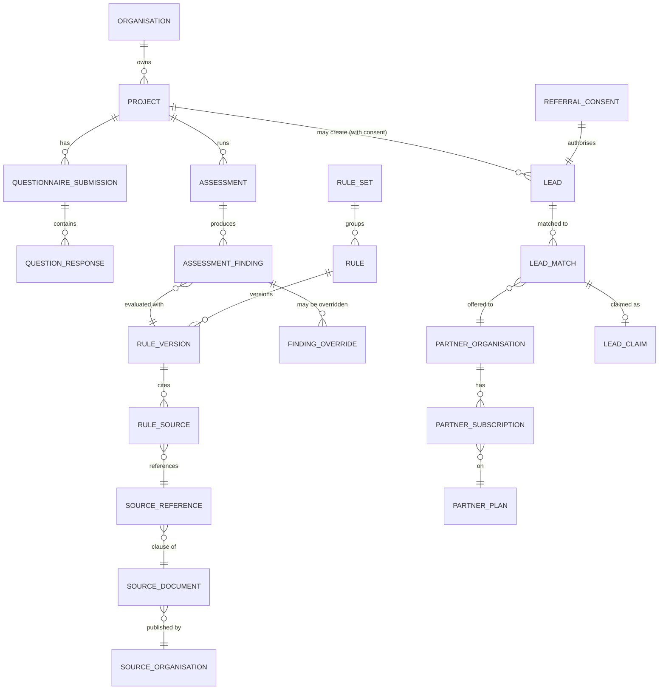

# PostgreSQL Domain Model

Status: **proposed**, built per milestone. Section 1 (identity, tenancy) and `audit_event`
are **built** (migration `0002`, Milestone 2); the rest is the plan.
Target: PostgreSQL 18, SQLAlchemy 2 declarative models, Alembic migrations.

## Conventions

| Convention | Rule |
|---|---|
| Primary keys | `id uuid` — UUIDv7 generated in the application (time-ordered, good B-tree locality). |
| Standard columns | `created_at timestamptz not null default now()`, `updated_at timestamptz not null default now()`, `created_by uuid null references app_user(id)`. |
| Soft delete | `deleted_at timestamptz null` on customer-facing aggregates (marked **SD**). Partial unique indexes use `where deleted_at is null`. |
| Append-only | Marked **AO**: no `updated_at`/`deleted_at`; app DB role has `INSERT, SELECT` only. |
| Immutable after publish | Marked **IM**: versions with `status = 'PUBLISHED'` reject updates (trigger). |
| Tenancy | Tenant-owned tables carry `organisation_id uuid not null` (marked **T**) + RLS policy `tenant_isolation` (`organisation_id = nullif(current_setting('app.current_org', true), '')::uuid`, forced, for reads and writes) as defence-in-depth behind application authorisation. References between tenant tables are composite `(organisation_id, x_id)` foreign keys. See ARCHITECTURE.md §3.1. |
| Enums | `text` + `CHECK (col in (...))`, mirrored by Python `StrEnum`. |
| Money | `amount_cents bigint not null`, `currency char(3) not null default 'AUD'`. |
| Geography | Postcode/suburb/LGA/state as columns; `location geography(Point,4326)` via PostGIS when radius matching lands (Milestone 15). |
| Names | snake_case, singular table names. `user` is reserved, so `app_user`. |

Shared enums:

* `confidence`: `VERIFIED`, `LIKELY`, `REVIEW_REQUIRED`, `UNKNOWN`
* `vertical`: `PLANNING`, `VESSEL`, `BUSINESS`, `GRANT`, `SELL`, `RENT`
* `jurisdiction`: `CTH`, `QLD`, `NSW`, `VIC`, `SA`, `WA`, `TAS`, `NT`, `ACT`, plus `LGA:<code>` held in `jurisdiction` table
* `verification_status`: `UNVERIFIED`, `VERIFIED`, `DISPUTED`, `SUPERSEDED`

---

## 1. Identity and tenancy (built, Milestone 2)

| Table | Key columns | Notes |
|---|---|---|
| `app_user` **SD** | `email citext unique` (stored lower-case), `email_verified_at`, `display_name`, `status` (`ACTIVE`,`LOCKED`,`SUSPENDED`,`DELETION_REQUESTED`), `last_login_at`, `locale` | No password here. |
| `password_credential` | `user_id unique`, `password_hash` (Argon2id), `password_changed_at` | Separate so OIDC/passkey-only users have none. Failed-attempt counters live in Redis, not here. |
| `auth_identity` | `user_id`, `provider` (`GOOGLE`,`MICROSOFT`,`PASSKEY`), `subject`, `public_key`, `last_used_at`, unique `(provider, subject)` | Future SSO/passkeys; schema only. |
| `auth_session` | `user_id`, `token_hash bytea unique`, `previous_token_hash` (partial unique), `previous_token_valid_until`, `surface`, `active_organisation_id`, `ip`, `user_agent`, `last_seen_at`, `rotated_at`, `idle_expires_at`, `expires_at`, `revoked_at`, `revoked_reason` | Opaque tokens. Rotation replaces the hash in place and keeps the previous one for a grace period (instead of a `rotated_from_id` chain). Named `auth_session` to avoid confusion with ORM sessions. |
| `one_time_token` | `user_id`, `purpose` (`EMAIL_VERIFY`,`PASSWORD_RESET`), `token_hash unique`, `expires_at`, `used_at` | Single use; issuing a new one invalidates older unused ones. |
| `organisation` **SD** | `kind` (`PERSONAL`,`BUSINESS`,`PROFESSIONAL_PRACTICE`,`PARTNER`,`PLATFORM_ADMIN`), `name`, `abn char(11) null` (format check; checksum validated in the API), `status` (`ACTIVE`,`SUSPENDED`), `created_by` | Every user gets a `PERSONAL` org. |
| `organisation_member` | `organisation_id`, `user_id`, `status` (`ACTIVE`,`REMOVED`), `created_by`, unique `(organisation_id, user_id)` | Removal is a status change; re-invitation reactivates the row. |
| `organisation_invitation` | `organisation_id`, `email citext`, `role_keys text[]`, `token_hash unique`, `expires_at`, `accepted_at`, `accepted_by`, `revoked_at`, `created_by`; partial unique `(organisation_id, email)` while open | Replaces the earlier `one_time_token` purpose `INVITE`: invitations carry roles and outlive a user account. |
| `role` | `key` unique (`CUSTOMER`,`ORG_ADMIN`,`PROFESSIONAL`,`PARTNER_USER`,`PARTNER_ADMIN`,`STAFF`,`ADMIN`,`SUPERADMIN`), `scope` (`ORG`,`PLATFORM`), `description`, `allowed_org_kinds text[]` | Seeded by migration. `ORG_ADMIN` added for business/practice owners. |
| `permission` | `key` unique (e.g. `org.members.manage`, `project.write`, `lead.claim`, `rule.publish`), `description` | Seeded. |
| `role_permission` | `role_id`, `permission_id` PK pair | Seeded. |
| `member_role` | `organisation_member_id`, `role_id` PK pair, `granted_by`, `granted_at` | Trigger rejects a role outside its `allowed_org_kinds` (so platform roles exist only in the `PLATFORM_ADMIN` org). |
| `audit_event` **AO** | `seq bigint identity unique`, `occurred_at`, `actor_user_id`, `organisation_id`, `action`, `target_type`, `target_id`, `ip`, `user_agent`, `request_id`, `details jsonb`, `prev_hash`, `hash unique` | No foreign keys (outlives what it describes). Triggers block UPDATE/DELETE/TRUNCATE; SHA-256 hash chain. |

## 2. Customer entities (built, Milestone 3, except where noted)

As built: `vessel_certificate` arrived in Milestone 9 with `title`, `issuer`, `notes`, an
`uploaded_document_id` (a clean upload, instead of `evidence_id`) and soft delete; its `kind` is
`CERTIFICATE_OF_SURVEY`, `CERTIFICATE_OF_OPERATION`, `EXEMPTION`, `STATE_REGISTRATION` or
`OTHER`. Milestone 9 also added `safety_management_system` (one per vessel project: `content`
jsonb of element key → text, `structure_hash`, `updated_by`) and `project_checklist` /
`checklist_item` (a reviewed checklist copied into a project; items `OPEN`, `DONE` or
`NOT_APPLICABLE` with a note). `customer_profile` and `business_profile.ownership_flags` are
not built yet (no milestone needs them before BusinessReady/VesselReady/GrantReady). `address`
is tenant-owned (**T**) so it can be protected by RLS; `property_ownership.evidence_id` waits
for documents (Milestone 6). Entities are reachable through the API; their UI arrives with
PlanningReady (Milestone 5).

| Table | Key columns | Notes |
|---|---|---|
| `customer_profile` **T SD** | `user_id`, `phone`, `preferred_contact`, `postcode` | PII; minimised in partner projections. |
| `business_profile` **T SD** | `abn`, `acn`, `legal_name`, `trading_name`, `entity_type`, `gst_registered`, `established_on`, `employee_band`, `turnover_band`, `anzsic_code`, `ownership_flags jsonb` (e.g. Indigenous/women-owned, self-declared), `address_id` | Reused by BusinessReady and GrantReady. |
| `address` | `line1`, `line2`, `suburb`, `state`, `postcode`, `lga_code`, `gnaf_pid null`, `latitude`, `longitude`, `source` (`USER`,`PROVIDER`) | Geocoding via provider interface (mock in dev). |
| `property` **T SD** | `address_id`, `lot_plan` (e.g. `12RP123456`), `title_reference`, `land_area_m2`, `zoning_code null`, `zoning_source_reference_id null`, `overlays jsonb`, `facts_retrieved_at` | Zoning only populated with provenance. |
| `property_ownership` **T** | `property_id`, `organisation_id`, `role` (`OWNER`,`AUTHORISED_AGENT`,`LANDLORD`,`PROSPECTIVE_BUYER`,`LESSEE`), `evidence_id null`, `verified_at` | |
| `vessel` **T SD** | `name`, `vessel_type`, `length_m numeric(6,2)`, `hull_material`, `propulsion`, `max_passengers`, `crew`, `operating_area` (AMSA class text, sourced), `activity`, `uvi null`, `hin null`, `state_rego null` | |
| `vessel_certificate` **T** | `vessel_id`, `kind`, `number`, `issued_on`, `expires_on`, `evidence_id` | |

## 3. Projects, tasks, reminders (built, Milestone 3)

As built: `project` adds `description`; status display labels live in the web app, not a
lookup table. `task` has `notes`, `status` (`OPEN`,`DONE`), `completed_at` (set exactly when
done), and no `kind`/`finding_id` until findings exist (Milestone 4). `reminder` is simplified
to `project_id`, `task_id null`, `recipient_user_id` (a member), `title`, `fires_at`
(timezone-aware, future), `channel` (`EMAIL`,`IN_APP`), `status`
(`SCHEDULED`,`SENT`,`CANCELLED`), `recurrence null` (`WEEKLY`,`MONTHLY`,`YEARLY`), `sent_at`;
Milestone 11 builds delivery: `project_id` becomes optional and reminders gain `source_key`
(set on reminders the system plans from dates, such as `tenancy:<id>:end:<date>:60`),
`body` and `link_path`, in place of the generic `subject_type/subject_id`.

| Table | Key columns | Notes |
|---|---|---|
| `project` **T SD** | `vertical`, `title`, `status` (`DRAFT`,`IN_PROGRESS`,`ASSESSED`,`IN_REVIEW`,`COMPLETED`,`ARCHIVED`), `property_id null`, `vessel_id null`, `business_profile_id null`, `reference_code` unique (human readable) | `ProjectVertical`/`ProjectStatus` are enums + lookup table for display labels. |
| `project_status_event` **AO** | `project_id`, `from_status`, `to_status`, `actor_id` | |
| `task` **T SD** | `project_id`, `title`, `kind`, `status`, `due_on`, `assignee_user_id`, `source` (`RULE`,`USER`,`REVIEWER`), `finding_id null` | Tasks generated from findings link back. |
| `reminder` **T** | `project_id null`, `subject_type`, `subject_id`, `fires_at`, `channel`, `status`, `recurrence_rule null` | RentReady rent review, lease renewal, etc. |

## 4. Questionnaire engine (built, Milestone 3)

As built: a question's `key` is its fact path (no separate `fact_path` column); address and
object answers also provide `key.field` facts. `questionnaire_version` adds `title`,
`description` and `content_hash` (re-syncing an unchanged definition is a no-op), with at most
one `PUBLISHED` version per questionnaire. `question_version` and `question_option` cannot be
changed once their version is published (triggers), and the application role can only read
definition tables. `question_response` has no `uploaded_document_id` yet: FILE answers are
rejected until uploads exist (Milestone 6). Submissions record `submitted_by`, responses
`answered_by`.

| Table | Key columns | Notes |
|---|---|---|
| `questionnaire` | `key` unique, `vertical`, `title` | |
| `questionnaire_version` **IM** | `questionnaire_id`, `version int`, `status` (`DRAFT`,`PUBLISHED`,`RETIRED`), `published_at`, unique `(questionnaire_id, version)` | |
| `question` | `key` (stable across versions, e.g. `property.lot_size_m2`) | |
| `question_version` **IM** | `questionnaire_version_id`, `question_id`, `ordinal`, `section`, `type` (`TEXT`,`TEXTAREA`,`NUMBER`,`DECIMAL`,`CURRENCY`,`BOOLEAN`,`SELECT`,`MULTISELECT`,`DATE`,`ADDRESS`,`FILE`,`OBJECT`), `label`, `help_text`, `required bool`, `validation jsonb` (min/max/regex/max_files/object schema), `visible_when jsonb null` (same condition AST as rules), `fact_path` | Branching = `visible_when`. |
| `question_option` | `question_version_id`, `value`, `label`, `ordinal` | |
| `questionnaire_submission` **T** | `project_id`, `questionnaire_version_id`, `status` (`IN_PROGRESS`,`SUBMITTED`), `submitted_at` | |
| `question_response` **T** | `submission_id`, `question_version_id`, `value jsonb`, `uploaded_document_id null`, unique `(submission_id, question_version_id)` | Validated against `question_version.type`. |

## 5. Regulatory sources and provenance

| Table | Key columns | Notes |
|---|---|---|
| `source_organisation` | `name`, `kind` (`LEGISLATURE`,`COUNCIL`,`STATE_AGENCY`,`CTH_AGENCY`,`REGULATOR`,`GRANT_BODY`), `jurisdiction`, `website` | e.g. Cairns Regional Council, AMSA, QLD Dept of State Development. |
| `source_document` | `source_organisation_id`, `jurisdiction`, `title`, `url`, `source_type` (`LEGISLATION`,`REGULATION`,`PLANNING_SCHEME`,`POLICY`,`GUIDELINE`,`FORM`,`FEE_SCHEDULE`,`WEBPAGE`,`GRANT_GUIDELINES`), `version_label`, `retrieved_at`, `effective_from`, `effective_to null`, `content_hash`, `archived_document_id` (snapshot in object storage), `supersedes_id null` | Snapshots kept so a cited version can be reproduced. |
| `source_reference` | `source_document_id`, `section`, `clause`, `page`, `extracted_text`, `structured_interpretation jsonb`, `verification_status`, `verified_by`, `verified_at`, `last_reviewed_at`, `next_review_due` | The atomic citation. |
| `source_review_event` **AO** | `source_reference_id`, `action`, `reviewer_id`, `notes` | |

As built (Milestone 4): snapshots are a separate append-only `source_snapshot` table
(`source_document_id`, `retrieved_at`, `content_text`, `content_hash`, `captured_by`), so
`source_document` has no `retrieved_at`/`content_hash`/`archived_document_id` (object storage
comes with Milestone 6). `source_reference` has `interpretation text` instead of
`structured_interpretation jsonb`, and `verified_snapshot_id` (the snapshot it was checked
against). Review events also store `from_status` and `to_status`. Jurisdiction codes are `CTH`,
a state or territory, or `LGA:<STATE>_<NAME>`.

## 6. Rules

| Table | Key columns | Notes |
|---|---|---|
| `rule_set` | `key` unique, `vertical`, `jurisdiction`, `title`, `scope jsonb` (e.g. LGA list) | e.g. `planning.qld.cairns.subdivision`. |
| `rule` | `rule_set_id`, `key` (stable), `title` | |
| `rule_version` **IM** | `rule_id`, `version int`, `status` (`DRAFT`,`IN_REVIEW`,`PUBLISHED`,`RETIRED`), `condition jsonb` (validated AST), `effective_from`, `effective_to`, `max_confidence`, `published_by`, `published_at`, `content_hash`, unique `(rule_id, version)` | `RuleCondition` lives in the AST; a normalised `rule_condition` table is not needed for evaluation but `rule_fact_dependency(rule_version_id, fact_path)` is materialised for "which rules use this question?". |
| `rule_outcome` | `rule_version_id`, `when` (`MATCH`,`NO_MATCH`,`UNKNOWN`), `outcome_type` (`APPROVAL_REQUIRED`,`APPROVAL_LIKELY`,`NOT_REQUIRED`,`EVIDENCE_REQUIRED`,`PROFESSIONAL_REQUIRED`,`REFERRAL_CATEGORY`,`CROSS_SELL`,`WARNING`,`INFO`), `payload jsonb`, `confidence` | Outcomes drive requirements, referral categories and cross-sell. |
| `rule_source` | `rule_version_id`, `source_reference_id`, `relationship` (`BASIS`,`SUPPORTING`,`EXCEPTION`) | Required for `VERIFIED`. |
| `rule_test_case` | `rule_version_id`, `facts jsonb`, `expected jsonb` | Must pass before publish. |

As built (Milestone 4): `rule_set.applies_when` (a condition) replaces `scope`, plus
`description`. `rule_version` has `DRAFT`, `PUBLISHED`, `RETIRED` (no `IN_REVIEW` yet), `notes`,
and at most one published version per rule; `rule_outcome` uses `on_result` with `title` and
`detail` and no per-outcome confidence (confidence is derived from sources). `rule_test_case`
has `name` and `expected_result`. Everything under a version is immutable once it leaves draft
(triggers).

## 7. Assessments

| Table | Key columns | Notes |
|---|---|---|
| `assessment` **T** | `project_id`, `submission_id`, `rule_set_id`, `engine_version`, `facts_snapshot jsonb`, `facts_hash`, `assessed_on date`, `status`, `overall_confidence` | Reproducible: same facts + same rule versions ⇒ same result. |
| `assessment_finding` **T AO** | `assessment_id`, `rule_version_id`, `result` (`MATCH`,`NO_MATCH`,`UNKNOWN`), `outcome_type`, `confidence`, `explanation_key`, `trace jsonb` (leaf-by-leaf evaluation), `missing_facts text[]` | Overrides are separate rows, never edits. |
| `approval_requirement` **T** | `assessment_id`, `finding_id`, `kind`, `authority_source_organisation_id`, `pathway`, `certainty` (`REQUIRED`,`LIKELY_REQUIRED`,`MAY_APPLY`,`NOT_IDENTIFIED`) | BusinessReady approval map uses `certainty`. |
| `evidence_requirement` **T** | `assessment_id`, `finding_id`, `kind`, `description_key`, `satisfied_by_evidence_id null` | |

As built (Milestone 4): one assessment covers every published rule set for the project's
vertical (`rule_sets jsonb` records each set's scope), with `engine_version`, `facts_hash`,
`status` (`COMPLETED`, `NO_APPLICABLE_RULES`) and `created_by`; both tables are append-only.
Findings store `ordinal`, the rule key and title, outcome `title`/`detail`, `confidence_reasons`
and cited `sources jsonb` as they stood at run time, instead of `explanation_key`.
`approval_requirement` and `evidence_requirement` are not built yet (Milestone 5).

As built (Milestone 5): findings carry the outcome's `payload`. `approval_requirement` has
`finding_id` (unique), `ordinal`, `kind`, `title`, free-text `authority` and `pathway` (no
link to a source organisation yet), `certainty` and the finding's `confidence`.
`evidence_requirement` has `kind`, `title`, `detail` and `confidence`; `satisfied_by_evidence_id`
waits for documents (Milestone 6). Both are append-only. Referral categories are read from the
finding payloads rather than stored separately. `task.finding_id` links a rule task to the
finding that suggested it, and `rule_set.limitations` lists what a rule set does not check.

## 8. Documents and evidence (built, Milestone 6)

| Table | Key columns | Notes |
|---|---|---|
| `uploaded_document` **T SD** | `storage_key`, `original_filename`, `declared_mime`, `detected_mime`, `size_bytes`, `sha256`, `scan_status` (`PENDING`,`CLEAN`,`INFECTED`,`ERROR`), `scanned_at`, `classification` (`PRIVATE`,`SHARED_WITH_REVIEWER`,`RELEASED_TO_PARTNER`) | Binary in object storage (local volume or S3). Unusable until `CLEAN`; infected files move to `quarantine/`. A FILE answer stores a list of these ids in `question_response.value`. |
| `evidence` **T** | `project_id`, `evidence_requirement_id null`, `uploaded_document_id`, `status` (`SUBMITTED`,`ACCEPTED`,`REJECTED`), `reviewed_by` | Built with `evidence_requirement_id` required and unique per document; review fields wait for Milestone 7. |
| `document_template` / `document_template_version` **IM** | `key` (`PLANNING_ASSESSMENT`,`BUSINESS_APPROVAL_MAP`,`VESSEL_PATHWAY`,`SMS`,`GRANT_ELIGIBILITY`,`GRANT_DRAFT`,`SELLER_READINESS`,`RENTAL_READINESS`,`CONDITION_REPORT`), `version`, `engine` (`JINJA_HTML`), `body`, `output_formats text[]` | |
| `generated_document` **T** | `project_id`, `assessment_id null`, `template_version_id`, `format` (`PDF`,`DOCX`,`HTML`), `storage_key`, `status`, `review_status`, `ai_job_id null`, `content_hash` | Built without `ai_job_id` (Milestone 10); stores `sha256`, `size_bytes`, `attempts` and `error`. Content always includes date, project ID, status, assumptions, missing info, sources, review status. |

## 9. AI

Built in Milestone 12 (migration 0012).

| Table | Key columns |
|---|---|
| `prompt_version` | `task` (`ASSESSMENT_EXPLANATION`, `GRANT_DRAFT`), `version`, `status` (`PUBLISHED`, `RETIRED`; one published per task), `system_prompt`, `user_template`, `output_schema_name`, `output_schema_version`, `content_hash`. Platform data, read-only for the app role, immutable (trigger). |
| `ai_job` **T** | `project_id`, `assessment_id`, `task`, `subject_id null` (grant program), `prompt_version_id`, `input_refs jsonb` (IDs and fact keys only), `input_hash`, `status` (`PENDING`, `SUCCEEDED`, `REJECTED`, `FAILED`), `output jsonb`, `validation_errors jsonb`, `error`, `attempts` |
| `ai_provider_log` **T AO** | `ai_job_id`, `project_id`, `task`, `prompt_version_id`, `schema_name`, `schema_version`, `provider`, `model`, `request_tokens`, `response_tokens`, `cost_micros`, `latency_ms`, `status` (`OK`, `ERROR`, `REFUSED`), `error` |

## 10. Professional review

| Table | Key columns |
|---|---|
| `professional` | `user_id`, `organisation_id` (practice), `discipline` (`TOWN_PLANNER`,`SURVEYOR`,`CERTIFIER`,`MARINE_SURVEYOR`,`LAWYER`,`ACCOUNTANT`,`GRANT_WRITER`…), `status` |
| `professional_credential` | `professional_id`, `kind`, `issuer`, `number`, `expires_on`, `evidence_id`, `verified_by`, `verified_at` |
| `professional_service` | `professional_id`, `vertical`, `service_key`, `price_id null` |
| `review_request` **T** | `project_id`, `assessment_id`, `status` (`DRAFT`,`REVIEW_REQUESTED`,`ASSIGNED`,`IN_REVIEW`,`CHANGES_REQUIRED`,`APPROVED`,`COMPLETED`), `assigned_professional_id`, `payment_id null`, `due_at` |
| `review_comment` **T** | `review_request_id`, `finding_id null`, `author_id`, `body` |
| `finding_override` **T AO** | `review_request_id`, `finding_id`, `new_outcome_type`, `new_confidence`, `reason`, `source_reference_id null`, `overridden_by` (always audited) |
| `review_decision` **T AO** | `review_request_id`, `decision`, `decided_by`, `notes` |

Built in Milestone 7 with these differences: `professional.practice_id` names the practice organisation and `discipline` uses `BUILDING_CERTIFIER`, `BUILDING_DESIGNER` and `ENGINEER`; credentials carry a `status` and `notes` instead of `evidence_id`; services have no `service_key` or `price_id` yet (Milestone 13); `review_request` has no `DRAFT` or `payment_id`, adds `CANCELLED`, `message`, `assigned_by/at`, `started_at`, `closed_at` and uses `due_on`; comments record `author_role`; overrides keep the previous outcome and confidence; decisions record the assessment and professional.

## 11. Billing (customers and partners)

| Table | Key columns | Notes |
|---|---|---|
| `product` | `key`, `kind` (`ONE_OFF`,`SAAS`,`PARTNER_PLAN`,`REVIEW`,`LEAD`,`CREDIT_PACK`), `vertical null`, `active` | |
| `price` | `product_id`, `amount_cents`, `currency`, `interval` (`ONE_TIME`,`MONTH`,`YEAR`), `stripe_price_id`, `active`, `valid_from`, `valid_to` | Admin-managed; no prices in code. |
| `feature` / `product_feature` | `feature.key` (e.g. `rent.properties.max`), `product_feature.limit_value` | RentReady FREE/MANAGE/MANAGE_PLUS are rows. |
| `subscription` | `subject_type` (`USER`,`ORGANISATION`,`PROPERTY`), `subject_id`, `price_id`, `status`, `stripe_subscription_id unique`, `current_period_end`, `cancel_at` | Entitlement scope as requested. |
| `payment` | `organisation_id`, `amount_cents`, `status`, `stripe_payment_intent_id`, `purpose`, `subject_type`, `subject_id` | |
| `invoice_reference` | `organisation_id`, `stripe_invoice_id unique`, `number`, `amount_cents`, `status`, `hosted_url` | No card data, ever. |
| `credit_ledger_entry` **AO** | `organisation_id`, `delta_cents`, `kind` (`PURCHASE`,`PROMO`,`LEAD_CHARGE`,`REFUND`,`ADJUSTMENT`), `reference_type`, `reference_id`, `balance_after_cents` | |
| `stripe_event` **AO** | `stripe_event_id unique`, `type`, `payload jsonb`, `processed_at`, `error` | Idempotent webhook processing. |

Built in Milestone 13 with these differences: `product` adds `name`, `description` and `sort_order` and comes from a reviewed catalogue file; `feature` adds `description`, `default_limit` (the free allowance) and `active`; `price` adds `deactivated_at` instead of `valid_from`/`valid_to` and never changes once made; `subscription` is always the organisation's (no `subject_type`) and adds `product_id`, `cancel_at_period_end`, `canceled_at`, `past_due_since` and `stripe_event_at`; `payment` adds `product_id`, `price_id`, `currency`, `stripe_checkout_session_id`, `refunded_cents` and `paid_at`; `invoice_reference` keeps `stripe_subscription_id`, both amounts, the PDF link and `issued_at`; `stripe_event` adds `livemode`, `organisation_id`, `status`, `attempts` and `received_at`; `billing_customer` (organisation ↔ Stripe customer) is new; entitlements are computed from subscriptions, not stored; `credit_ledger_entry` waits for Milestone 15.

## 12. Partners and marketplace

| Table | Key columns | Notes |
|---|---|---|
| `marketplace_category` | `key` (e.g. `cadastral_surveyor`, `marine_surveyor`, `smoke_alarm_technician`), `vertical[]`, `requires_credential bool`, `restricted bool` | Shared taxonomy. `PartnerCategory` = membership of partner in a category. Built in Milestone 8 with `label`, `description`, `verticals`, `active` and `sort_order`, synced from `app/modules/marketplace/categories.json`; rule outcomes' `referral_categories` must name active keys. |
| `partner_organisation` | `organisation_id unique`, `verification_status` (`APPLIED`,`UNDER_REVIEW`,`VERIFIED`,`ACTIVE`,`SUSPENDED`,`REJECTED`), `abn`, `website`, `description`, `max_open_leads`, `paused` | `PartnerAccount` ≡ organisation of kind `PARTNER`; `PartnerUser` ≡ member with partner role. No duplicate user table. |
| `partner_application` | `partner_organisation_id`, `submitted_payload jsonb`, `status`, `reviewed_by`, `decision_notes` | |
| `partner_category` | `partner_organisation_id`, `category_id`, `status`, `credential_id null` | |
| `partner_credential` | `partner_organisation_id`, `kind` (`LICENCE`,`PI_INSURANCE`,`PL_INSURANCE`,`ACCREDITATION`), `number`, `insurer`, `cover_cents`, `expires_on`, `evidence_id`, `verified_by` | |
| `partner_service_area` | `partner_organisation_id`, `kind` (`POSTCODE`,`LGA`,`STATE`,`RADIUS`), `value`, `radius_km null`, `centre geography null` | |
| `partner_lead_preference` | `partner_organisation_id`, `category_id`, `project_types text[]`, `min_value_band`, `max_value_band`, `timing text[]`, `notify` | |
| `partner_plan` | `key` (`FREE`,`STANDARD`,`PRO`,`ENTERPRISE`), `product_id`, `grace_period_days`, `active` | Seed data, not code. |
| `plan_feature` | `partner_plan_id`, `feature_key`, `limit_value`, `bool_value` | |
| `partner_subscription` | `partner_organisation_id`, `partner_plan_id`, `subscription_id`, `status`, `past_due_since` | Mirrors Stripe; webhook-driven only. |
| `provider_profile` | `partner_organisation_id`, `slug unique`, `public bool`, `headline`, `service_summary` | Public SEO/trust page. |
| `lead_price` | `category_id`, `value_band`, `partner_plan_id null`, `price_id` | |

## 13. Leads, consent, referrals, quotes

| Table | Key columns | Notes |
|---|---|---|
| `consent_text_version` | `purpose` (`SERVICE`,`MARKETING`,`PARTNER_REFERRAL`), `version`, `body`, `published_at` | Exact wording a user agreed to. |
| `consent` **AO** | `user_id`, `consent_text_version_id`, `granted bool`, `ip`, `user_agent` | Grants and withdrawals are rows. |
| `referral_consent` **T AO** | `user_id`, `project_id`, `consent_text_version_id`, `categories text[]`, `max_providers`, `fields_released text[]` (e.g. `name`,`phone`,`email`,`site_address`), `granted_at`, `withdrawn_at null` | Required before a lead exists. |
| `lead_release_policy` | `category_id null`, `vertical null`, `max_providers`, `claim_window_hours`, `expires_after_days`, `tier` (`STANDARD`,`PREMIUM`) | |
| `lead` **T** | `project_id`, `referral_consent_id not null`, `category_id`, `vertical`, `region_label`, `postcode`, `lga_code`, `project_type`, `stage`, `timing`, `value_band`, `tier`, `status` (`AVAILABLE`,`EXPIRED`,`CLOSED`), `anonymised_summary jsonb`, `expires_at` | `anonymised_summary` built from whitelist. |
| `lead_match` | `lead_id`, `partner_organisation_id`, `score numeric`, `score_breakdown jsonb`, `is_promoted bool`, `status` (`MATCHED`,`VIEWED`,`CLAIMED`,`CONTACTED`,`QUOTED`,`WON`,`LOST`,`EXPIRED`,`DECLINED`), unique `(lead_id, partner_organisation_id)` | |
| `lead_claim` | `lead_match_id unique`, `claimed_by`, `entitlement_snapshot jsonb`, `fee_cents`, `credit_ledger_entry_id`, `released_fields text[]` | |
| `lead_status_event` **AO** | `lead_match_id`, `from_status`, `to_status`, `actor_id`, `note` | |
| `referral` **T** | `project_id`, `lead_match_id`, `professional_id null`, `commercial_relationship bool`, `disclosure_text_version_id` | Disclosure shown to customer is recorded. |
| `quote_request` **T** | `project_id`, `category_id`, `description`, `lead_id null` | |
| `quote` | `quote_request_id`, `partner_organisation_id`, `amount_cents`, `valid_until`, `document_id`, `status` | |

## 14. GrantReady

| Table | Key columns |
|---|---|
| `grant_profile` **T** | `business_profile_id`, `proposed_project`, `expenditure_cents`, `co_contribution_cents`, `location_address_id` |
| `grant_program` | `source_organisation_id`, `title`, `jurisdiction`, `source_document_id`, `url` |
| `grant_round` | `grant_program_id`, `opens_at`, `closes_at`, `status`, `source_reference_id` (dates must cite source) |
| `grant_eligibility_rule` | `grant_round_id`, `rule_version_id` (eligibility is ordinary versioned rules) |
| `grant_match` **T** | `grant_profile_id`, `grant_round_id`, `assessment_id`, `status` (`STRONG_MATCH`,`POSSIBLE_MATCH`,`NOT_ELIGIBLE`,`NEEDS_INFORMATION`), `missing_facts text[]` |

Built in Milestone 10 with these differences: there is no `grant_profile` table (the grant
questionnaire's answers, prefilled from the linked business profile, are the profile, so
nothing is stored twice); `grant_program` has `key`, `summary`, `administrator_id` (a source
organisation), `rule_set_id` (unique: eligibility is one `GRANT` rule set per program, so no
`grant_eligibility_rule` table), `funding_summary`, `min_amount_cents`, `max_amount_cents`
and `status` (`ACTIVE`, `RETIRED`); `grant_round` has `title`, `status` (`UPCOMING`, `OPEN`,
`PAUSED`, `CLOSED`, as the source says), `opens_on`/`closes_on` dates, `dates_note` and a
required `source_reference_id`; `grant_match` is append-only per assessment with
`program_id`, `round_id` (the round shown at the time), `ordinal`, `confidence` and
`criteria jsonb`.

## 15. PropertyReady (SellReady + RentReady) (built, Milestone 11)

As built: tables hang off the project rather than the property (one `sale_project` per sell
project, one `rental_property` per rent project), so they follow the project's tenant and
vertical. `sale_project` statuses are `PREPARING`, `READY_TO_LIST`, `LISTED`, `UNDER_OFFER`,
`UNDER_CONTRACT`, `SETTLED`, `WITHDRAWN`, with `listed_on`, `contract_on`, `settlement_on` and
the disclosure recorded on the sale (`disclosure_given_on/to`, `disclosure_document_ids`, or a
not-needed note). The vault is `sale_document` (upload, category, `in_disclosure`). The rental
profile is `rental_property` (listing status, rent and period, bond, bedrooms, bathrooms);
`tenancy` status is computed from its dates; `tenant_application.checks` holds whether each
document was provided (no scores); `maintenance_item` replaces `property_maintenance_item`.
Inspections have no `SALE_OPEN_HOME` kind yet.

| Table | Key columns |
|---|---|
| `sale_project` **T** | `project_id unique`, `property_id`, `status` (`PREPARING`,`READY_TO_LIST`,`LISTED`,`UNDER_OFFER`,`CONTRACT`,`SETTLEMENT`,`COMPLETED`,`WITHDRAWN`), `asking_price_cents null`, `disclosure_status` |
| `sale_offer` **T** | `sale_project_id`, `buyer_name`, `buyer_contact`, `amount_cents`, `conditions`, `status`, `received_at` |
| `sale_enquiry` **T** | `sale_project_id`, `contact`, `message`, `status` |
| `rental_property_profile` **T** | `property_id unique`, `bedrooms`, `bathrooms`, `parking`, `furnished`, `minimum_standards_status`, `smoke_alarm_compliance_status` |
| `tenancy` **T** | `rental_property_profile_id`, `status`, `start_on`, `end_on`, `rent_cents`, `rent_period`, `bond_cents`, `bond_lodgement_reference`, `next_rent_review_on` |
| `tenant_application` **T** | `rental_property_profile_id`, `applicant_contact`, `status`, `documents`, `checklist jsonb` (objective facts and missing evidence only; no AI score) |
| `inspection` **T** | `property_id`, `tenancy_id null`, `kind` (`ENTRY`,`ROUTINE`,`EXIT`,`SALE_OPEN_HOME`), `scheduled_at`, `completed_at`, `status` |
| `inspection_item` **T** | `inspection_id`, `room`, `item`, `condition`, `notes`, `photo_document_ids uuid[]` |
| `property_maintenance_item` **T** | `property_id`, `title`, `priority`, `status`, `reported_at`, `quote_request_id null` |

## 16. Platform

| Table | Key columns | Notes |
|---|---|---|
| `audit_event` **AO** | See section 1 (built). Before/after values go in `details`. | Monthly range partitions when volume warrants (the chain is ordered by `seq`, so partitioning does not affect verification). |
| `notification` **T** | Built in Milestone 11 as `recipient_user_id`, `kind` (`REMINDER`,`GRANT_ROUND`,`SOURCES_DUE`), `title`, `body`, `link_path`, `project_id null`, `reminder_id null`, `dedupe_key` (unique per recipient), `email_status`, `emailed_at`, `read_at` | In-app always; email when requested. No SMS yet. |
| `brand` | `key`, `product_name`, `logo_asset`, `theme_accent`, `default_vertical`, `seo jsonb` | |
| `brand_domain` | `hostname unique`, `brand_id`, `surface`, `mode` (`PRIMARY`,`REDIRECT`,`ALIAS`), `redirect_target` | |
| `feature_flag` | `key`, `scope`, `value jsonb` | |
| `cross_sell_offer` | `from_vertical`, `to_vertical`, `rule_version_id`, `message_key` | Rules-driven cross-selling. |

## Core provenance ER diagram

